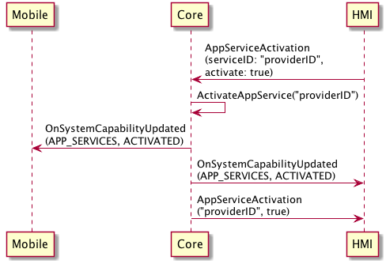
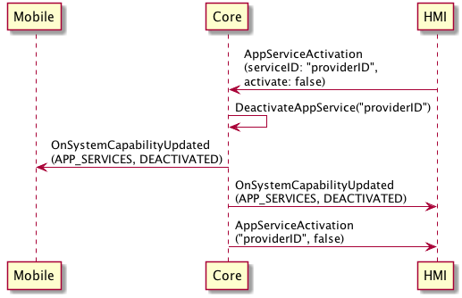
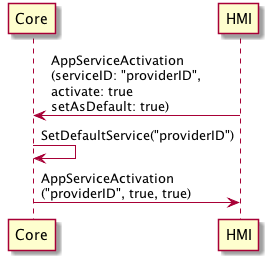

## AppServiceActivation

Type
: Function

Sender
: HMI

Purpose
: Request to activate/deactivate a given service, as well as set a service to the default

### Request

!!! NOTE
SDL will:
1. Activate the service with ID `serviceID` if `activate` is set to true and the service is currently inactive. This will deactivate the current active service of its type.
2. Deactivate the service with ID `serviceID` if `activate` is set to false and the service is currently active. If the <span title="App Service Consumer">ASC</span> is a mobile application, the embedded service for this type will be activated in its place if available.
3. Make the service with ID `serviceID` the default service for its type if `setAsDefault` is set to true. This will replace the existing default service for this service type.
4. Unset the service with ID `serviceID` as the default service for its service type if `setAsDefault` is set to false and this service is currently the default.
!!!

#### Parameters

|Name|Type|Mandatory|Additional|
|:---|:---|:--------|:---------|
|serviceID|String|true||
|activate|Boolean|true||
|setAsDefault|Boolean|false||

### Response

#### Parameters

|Name|Type|Mandatory|Additional|
|:---|:---|:--------|:---------|
|serviceID|String|true||
|activate|Boolean|true||
|setAsDefault|Boolean|false||

### Sequence Diagrams
|||
AppServiceActivation activate service

|||

|||
AppServiceActivation deactivate service

|||

|||
AppServiceActivation set default service

|||

### Example Request

```json
{
   "id": 1000,
   "jsonrpc": "2.0",
   "method": "AppService.AppServiceActivation",
   "params": {
      "serviceID": "service_id",
      "activate": true,
      "setAsDefault": true
   }
}
```

### Example Response

```json
{
   "id" : 1000,
   "jsonrpc" : "2.0",
   "result" : {
      "serviceID": "service_id",
      "activate": true,
      "setAsDefault": true,
      "code" : 0,
      "method" : "AppService.AppServiceActivation"
   }
}
```

### Example Error

```json
{
   "id" : 1000,
   "jsonrpc" : "2.0",
   "result" : {
      "code" : 13,
      "message" : "No known service with given ID",
      "data" : {
          "method" : "AppService.AppServiceActivation"
      }
   }
}
```
