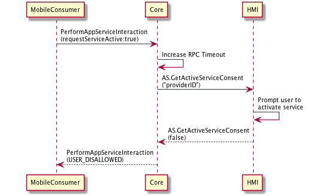

## GetActiveServiceConsent

Type
: Function

Sender
: SDL

Purpose
: Request an app service to become the active service of it's type

### Request

!!! MUST
1. Prompt user to activate service with `serviceID`
2. Respond with the result from the user in the `activate` parameter
!!!

#### Parameters

|Name|Type|Mandatory|Additional|
|:---|:---|:--------|:---------|
|serviceID|String|true||

### Response

#### Parameters

|Name|Type|Mandatory|Additional|
|:---|:---|:--------|:---------|
|activate|Boolean|true||

### Sequence Diagrams
|||
GetActiveServiceConsent

|||

|||
GetActiveServiceConsent

|||

### Example Request

```json
{
   "id": 1000,
   "jsonrpc": "2.0",
   "method": "AppService.GetActiveServiceConsent",
   "params": {
      "serviceID": "service_id"
   }
}
```

### Example Response

```json
{
   "id" : 1000,
   "jsonrpc" : "2.0",
   "result" : {
      "activate" : true,
      "code" : 0,
      "method" : "AppService.GetActiveServiceConsent"
   }
}
```

### Example Error

```json
{
   "id" : 1000,
   "jsonrpc" : "2.0",
   "result" : {
      "code" : 13,
      "message" : "No known service with given ID",
      "data" : {
          "method" : "AppService.GetActiveServiceConsent"
      }
   }
}
```