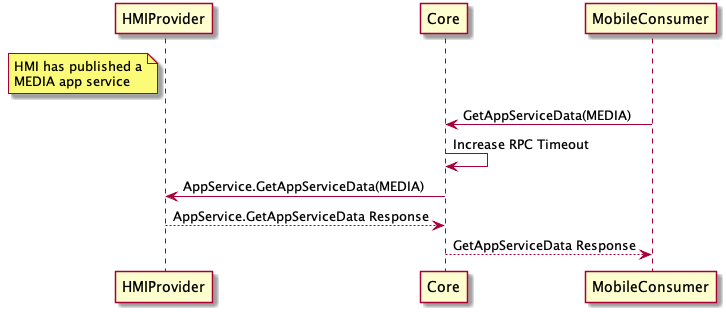
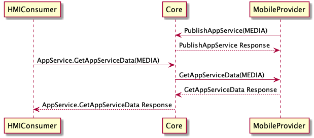

## GetAppServiceData

Type
: Request

Sender
: HMI / SDL

Purpose
: Requests app service data from the active service of a given type. Also gives the option to subscribe to future app service data updates for this serviceType

!!! note

* **HMI->SDL** if HMI App Service Consumer (<abbr title="App Service Consumer">ASC</abbr>) is requesting service data
* **SDL->HMI** if HMI App Service Provider (<abbr title="App Service Provider">ASP</abbr>) is receiving a service data request

!!!

### Request

#### Parameters

|Name|Type|Mandatory|Additional|
|:---|:---|:--------|:---------|
|serviceType|String|true||
|subscribe|Boolean|false||

### Response

#### Parameters

|Name|Type|Mandatory|Additional|
|:---|:---|:--------|:---------|
|serviceData|[Common.AppServiceData](../../common/structs/#appservicedata)|false||

### Sequence Diagrams

|||
GetAppServiceData (HMI Provider)

|||

|||
GetAppServiceData (HMI Consumer)

|||

### JSON Message Examples

#### Example Request

```json
{
  "id": 1000,
  "jsonrpc": "2.0",
  "method": "AppService.GetAppServiceData",
  "params": {
    "serviceType": "MEDIA"
  }
}
```

#### Example Response

```json
{
  "id": 1000,
  "jsonrpc": "2.0",
  "result": {
    "code": 0,
    "method": "AppService.GetAppServiceData",
    "serviceData": {
      "mediaServiceData": {
        "isExplicit": false,
        "mediaAlbum": "Book Name",
        "mediaArtist": "Author name",
        "mediaTitle": "Chapter name",
        "mediaType": "AUDIOBOOK",
        "queueCurrentTrackNumber": 12,
        "queuePlaybackDuration": 4000,
        "queuePlaybackProgress": 2200,
        "queueTotalTrackCount": 25,
        "trackPlaybackDuration": 300,
        "trackPlaybackProgress": 200
      },
      "serviceID": "9c6697b90f561cc599af19f81e9cf68a6848d6df1cdd63820d75ebfd7c727a20",
      "serviceType": "MEDIA"
    }
  }
}
```

#### Example Error

```json
{
  "error": {
    "code": 9,
    "data": {
      "method": "AppService.GetAppServiceData"
    },
    "message": "No app service provider with serviceType: MUSIC is available"
  },
  "id": 1000,
  "jsonrpc": "2.0"
}
```
