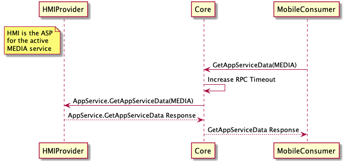
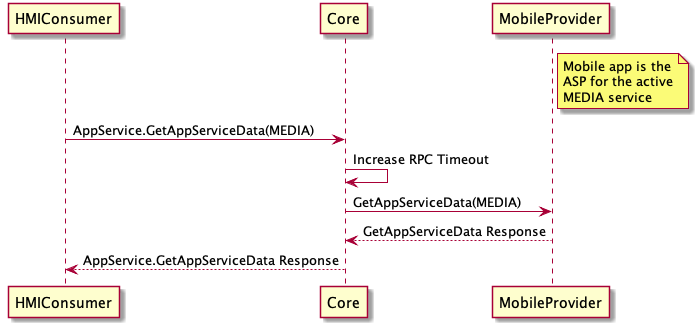

## GetAppServiceData

Type
: Request

Sender
: HMI / SDL

Purpose
: Requests an app service provider for current data related to a specific service. It also includes an option to subscribe to that service for future updates

### Request

#### Parameters

|Name|Type|Mandatory|Additional|
|:---|:---|:--------|:---------|
|serviceType|String|true||
|subscribe|Boolean|false||

### Response

#### Parameters

|Name|Type|Mandatory|Additional|
|:---|:---|:--------|:---------|
|serviceData|[Common.AppServiceData](../../common/structs/#appservicedata)|false||

### Sequence Diagrams
|||
GetAppServiceData (HMI Provider)

|||

|||
GetAppServiceData (HMI Consumer)

|||

### Example Request

```json
{
  "id": 1000,
  "jsonrpc": "2.0",
  "method": "AppService.GetAppServiceData",
  "params": {
    "serviceType": "MEDIA"
  }
}
```
### Example Response

```json
{
  "id": 1000,
  "jsonrpc": "2.0",
  "result": {
    "code": 0,
    "method": "AppService.GetAppServiceData",
    "resultCode": 0,
    "serviceData": {
      "mediaServiceData": {
        "isExplicit": false,
        "mediaAlbum": "Book Name",
        "mediaArtist": "Author name",
        "mediaTitle": "Chapter name",
        "mediaType": "AUDIOBOOK",
        "queueCurrentTrackNumber": 12,
        "queuePlaybackDuration": 4000,
        "queuePlaybackProgress": 2200,
        "queueTotalTrackCount": 25,
        "trackPlaybackDuration": 300,
        "trackPlaybackProgress": 200
      },
      "serviceID": "9c6697b90f561cc599af19f81e9cf68a6848d6df1cdd63820d75ebfd7c727a20",
      "serviceType": "MEDIA"
    },
    "success": true
  }
}
```
