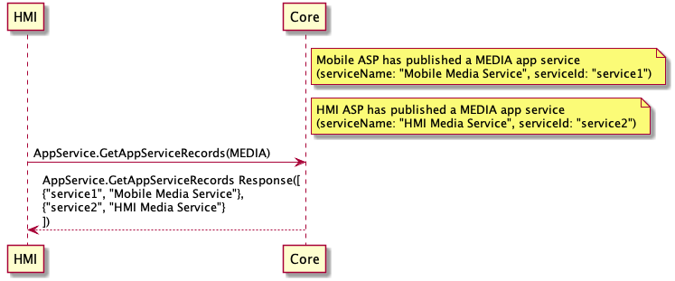

## GetAppServiceRecords

Type
: Request

Sender
: HMI

Purpose
: Get service records of a specific service type.

!!! note

If `serviceType` is not included in request, all service records will be returned

!!!

### Request

#### Parameters

|Name|Type|Mandatory|Additional|
|:---|:---|:--------|:---------|
|serviceType|String|false||

### Response

#### Parameters

|Name|Type|Mandatory|Additional|
|:---|:---|:--------|:---------|
|serviceRecords|[Common.AppServiceRecord](../../common/structs/#appservicerecord)|false|array: true|

### Sequence Diagrams

|||
GetAppServiceRecords

|||

### JSON Message Examples

#### Example Request

```json
{
  "id": 1003,
  "jsonrpc": "2.0",
  "method": "AppService.GetAppServiceRecords",
  "params": {
    "serviceType": "MEDIA"
  }
}
```

#### Example Response

```json
{
  "id": 1003,
  "jsonrpc": "2.0",
  "result": {
    "code": 0,
    "method": "AppService.GetAppServiceRecords",
    "serviceRecords": [
      {
        "serviceActive": false,
        "serviceID": "c9503a4f983e3dd31a7a14564d405cdf84769c9b9a71cae9cc211a0b74e93629",
        "serviceManifest": {
          "allowAppConsumers": true,
          "rpcSpecVersion": {
            "majorVersion": 5,
            "minorVersion": 1,
            "patchVersion": 0
          },
          "serviceName": "Mobile Media Service",
          "serviceType": "MEDIA"
        },
        "servicePublished": true
      },
      {
        "serviceActive": true,
        "serviceID": "d6d8d2fb2bfcc00033804fb19e9fb7d6070d2c166f49881563276f17478c39f8",
        "serviceManifest": {
          "allowAppConsumers": true,
          "rpcSpecVersion": {
            "majorVersion": 5,
            "minorVersion": 1,
            "patchVersion": 0
          },
          "serviceName": "Waze Music",
          "serviceType": "MEDIA"
        },
        "servicePublished": true
      }
    ]
  }
}
```

#### Example Error

```json
{
  "id" : 176,
  "jsonrpc" : "2.0",
  "error" :
  {
    "code" : 22,
    "message" : "Request timeout",
    "data" :
    {
      "method" : "AppService.GetAppServiceRecords"
    }
  }
}
```
