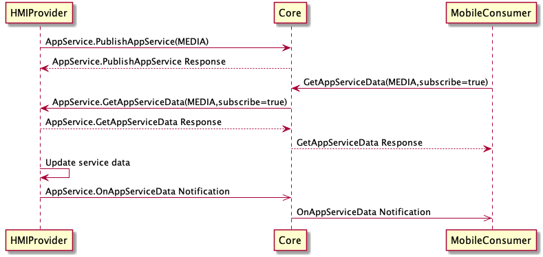
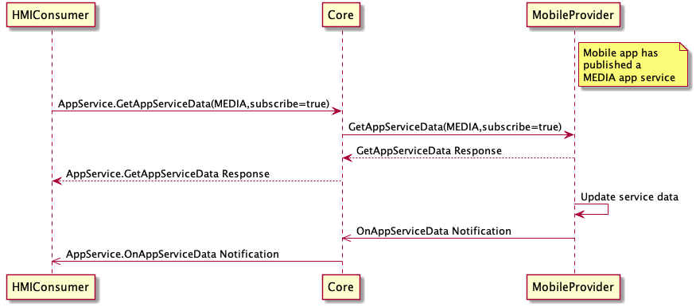

## OnAppServiceData

Type
: Notification

Sender
: HMI / SDL

Purpose
: Sent by the app service provider when AppServiceData of a subscribed service is updated. **HMI->SDL** if the HMI is a producer, **SDL->HMI** if the HMI is a consumer

### Notification

#### Parameters

|Name|Type|Mandatory|Additional|
|:---|:---|:--------|:---------|
|serviceData|[Common.AppServiceData](../../common/structs/#)|true||


### Sequence Diagrams
|||
OnAppServiceData (HMI Provider)

|||

|||
OnAppServiceData (HMI Consumer)

|||

### Example Notification

```json
{
  "jsonrpc": "2.0",
  "method": "AppService.OnAppServiceData",
  "params": {
    "serviceData": {
      "mediaServiceData": {
        "isExplicit": false,
        "mediaAlbum": "Book Name",
        "mediaArtist": "Author name",
        "mediaTitle": "Chapter name",
        "mediaType": "AUDIOBOOK",
        "queueCurrentTrackNumber": 12,
        "queuePlaybackDuration": 4000,
        "queuePlaybackProgress": 2200,
        "queueTotalTrackCount": 25,
        "trackPlaybackDuration": 300,
        "trackPlaybackProgress": 200
      },
      "serviceID": "9c6697b90f561cc599af19f81e9cf68a6848d6df1cdd63820d75ebfd7c727a20",
      "serviceType": "MEDIA"
    }
  }
}
```
