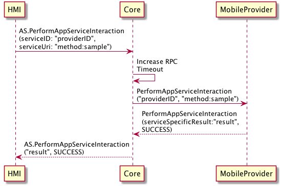

## PerformAppServiceInteraction

Type
: Function

Sender
: SDL / HMI

Purpose
: Request a service provider to perform a predefined action.

### Request

!!! MUST
Process `serviceUri` according to whatever predefined schema is offered by the HMI service
!!!

!!! NOTE
If the HMI is the ASC, SDL will:
1. Activate the service specified with `serviceID` if `requestServiceActive` is set to `true`
!!!

#### Parameters

|Name|Type|Mandatory|Additional|
|:---|:---|:--------|:---------|
|serviceUri|String|true||
|serviceID|String|true||
|originApp|String|false|Non-mandatory only if HMI is the ASC|
|requestServiceActive|Boolean|false||

### Response

#### Parameters

|Name|Type|Mandatory|Additional|
|:---|:---|:--------|:---------|
|serviceSpecificResult|String|false||

### Sequence Diagrams
|||
PerformAppServiceInteraction with HMI ASC

|||

|||
PerformAppServiceInteraction with Mobile ASC

|||

### Example Request

```json
{
   "id": 1000,
   "jsonrpc": "2.0",
   "method": "AppService.PerformAppServiceInteraction",
   "params": {
      "serviceUri": "host:sample.service.uri",
      "serviceID": "service_id",
      "originApp": "123456"
   }
}
```

### Example Response

```json
{
   "id" : 1000,
   "jsonrpc" : "2.0",
   "result" : {
      "serviceSpecificResult" : "QUEUED",
      "code" : 0,
      "method" : "AppService.PerformAppServiceInteraction"
   }
}
```

### Example Error

```json
{
   "id" : 1000,
   "jsonrpc" : "2.0",
   "result" : {
      "code" : 1,
      "message" : "No known service interaction matching URI",
      "data" : {
          "method" : "AppService.PerformAppServiceInteraction"
      }
   }
}
```