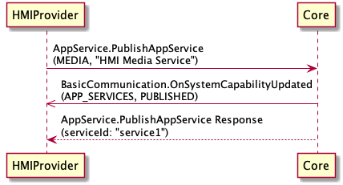

## PublishAppService

Type
: Function

Sender
: HMI

Purpose
: Registers a service offered by the HMI on the module

!!! note

An app service may send a PublishAppService RPC request mutiple times. Additional PublishAppService RPC requests will update the app service manifest and trigger an OnSystemCapabilityUpdated notification.

!!!


### Request

#### Parameters

|Name|Type|Mandatory|Additional|
|:---|:---|:--------|:---------|
|appServiceManifest|[Common.AppServiceManifest](../../common/structs/#appservicemanifest)|true||

### Response

#### Parameters

|Name|Type|Mandatory|Additional|
|:---|:---|:--------|:---------|
|appServiceRecord|[Common.AppServiceRecord](../../common/structs/#appservicerecord)|false||

### Sequence Diagrams
|||
PublishAppService

|||

### Example Request

```json
{
	"id": 1000,
	"jsonrpc": "2.0",
	"method": "AppService.PublishAppService",
	"params": {
		"appServiceManifest": {
			"allowAppConsumers": true,
			"handledRPCs": [41],
			"rpcSpecVersion": {
				"majorVersion": 5,
				"minorVersion": 1
			},
			"serviceName": "IVI_Media",
			"serviceType": "MEDIA"
		}
	}
}
```

### Example Response

```json
{
   "id" : 1000,
   "jsonrpc" : "2.0",
   "result" : {
      "appServiceRecord" : {
         "serviceActive" : true,
         "serviceID" : "1f89547cc0b12d5a52e896c45e141497f7af50e1e2dc8705914e75ef6fbeac03",
         "serviceManifest" : {
            "allowAppConsumers" : true,
            "handledRPCs" : [ 41 ],
            "rpcSpecVersion" : {
               "majorVersion" : 5,
               "minorVersion" : 1
            },
            "serviceName" : "IVI_Media",
            "serviceType" : "MEDIA"
         },
         "servicePublished" : true
      },
      "code" : 0,
      "method" : "AppService.PublishAppService"
  }
}
```