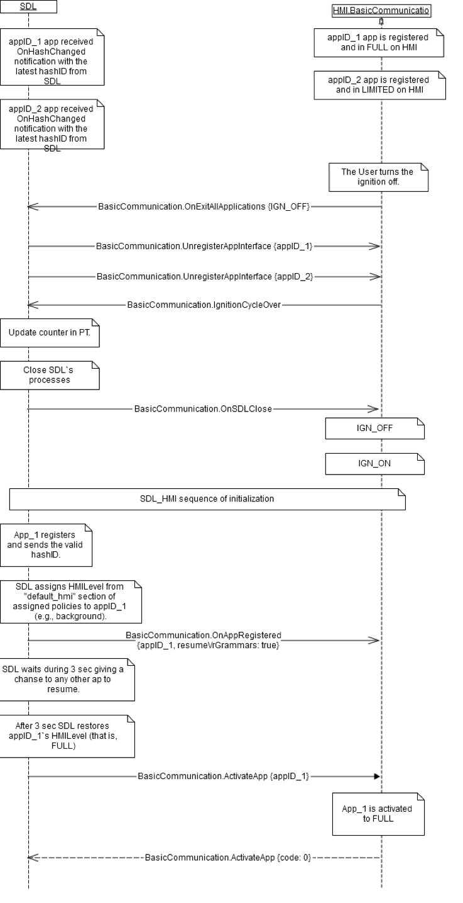
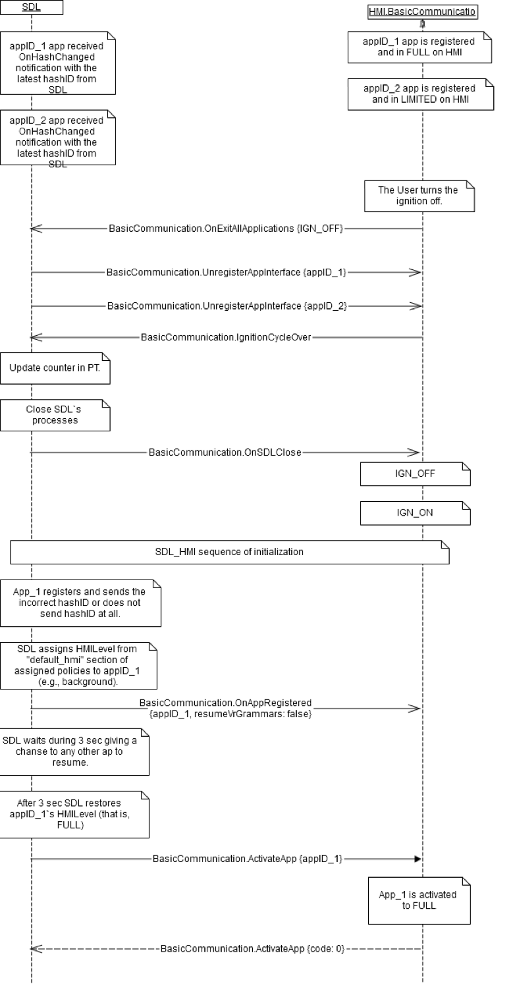
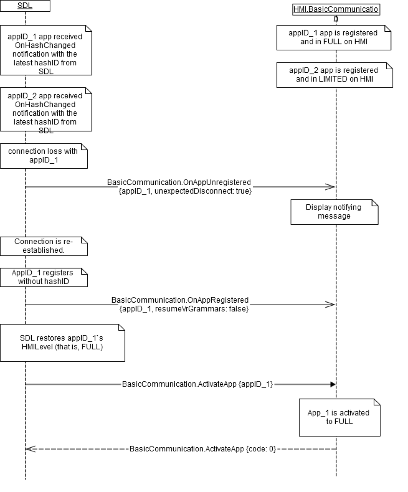
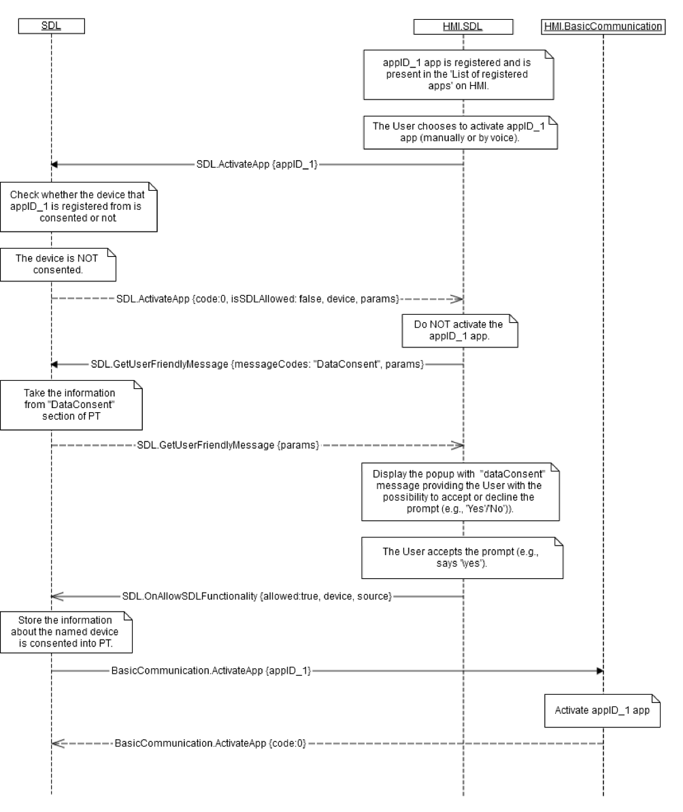

## ActivateApp

!!! note

The activated application is assumed to receive access to the head unit's display, audio and control system which are:
  * Supported by the head unit and
  * Confirmed to be supported via responses to `IsReady` requests sent by SDL for the corresponding component

In the case of a successful HMILevel resumption, SDL will first assign a 'default_hmi' level from policies with a 3 second timeout, before resuming the application to either FULL or LIMITED.

If the HMI receives `ActivateApp` it can be assumed that the HMI has also already been provided with detailed information about the application through the [OnAppRegistered](../OnAppRegistered) RPC

!!!

!!! may

This request may be sent:
  * After SDL restores the application's state saved during a previous ignition off

!!!

### Behavior

If `level` is `FULL` or `LIMITED`: 
!!! must

  1. Activate the application on the HMI
    * Display [UI.Show](../../UI/Show) related parameters associated with the named `appID` in the case they were previously requested within ignition cycle
    * Display the corresponding template in the case one was previously requested by [UI.SetDisplayLayout](../../UI/SetDisplayLayout) for that application
    * Apply [UI.SetGlobalProperties](../../UI/SetGlobalProperties) associated with the named `appID`, if any
    * Apply [UI.AddSubMenu](../../UI/AddSubMenu) associated with the named `appID`, if any
  2. Make VR commands accessible from previous [VR.AddCommand](../VR/AddCommand) for the named `appID` during the same ignition cycle
  3. Apply [TTS.SetGlobalProperties](../../TTS/SetGlobalProperties) associated with the `appID` in case previously requested since application registration
  4. Assign priority based on the `priority` parameter received. If the parameter is omitted, the HMI must assign a priority of `NONE` by default
  5. Respond with `SUCCESS` result code after the previous requirements have been met
  6. Set up the application as the active audio source if it is a media or navigation type application

!!!

### Request

#### Parameters

|Name|Type|Mandatory|Additional|
|:---|:---|:--------|:---------|
|appID|Integer|true||
|priority|[Common.AppPriority](../../common/enums/#apppriority)|false||
|level|[Common.HMILevel](../../common/enums/#hmilevel)|false|Included if the hmi level of this application should be changed to anything other than `FULL`. Should not be `NONE`.|

### Response

#### Parameters

This RPC has no additional parameter requirements

### Example Request

```json
{
  "id" : 47,
  "jsonrpc" : "2.0",
  "method" : "BasicCommunication.ActivateApp",
  "result" :
  {
    "appID" : 65368
  }
}
```
### Example Response

```json
{
  "id" : 47,
  "jsonrpc" : "2.0",
  "result" :
  {
    "code" : 0,
    "method" : "BasicCommunication.ActivateApp"
  }
}
```

### Example Error

```json
{
  "id" : 47,
  "jsonrpc" : "2.0",
  "error" :
  {
    "code" : 13,
    "message" : "One of the provided IDs is not valid.",
    "data" :
    {
      "method" : "BasicCommunication.ActivateApp"
    }
  }
}
```

### Sequence Diagrams
|||
Activate App after successful Resumption

|||
|||
Activate App after failed Resumption

|||
|||
Activate App after Unexpected Disconnect

|||
|||
Activate App after Accepted Data Consent Prompt

|||
