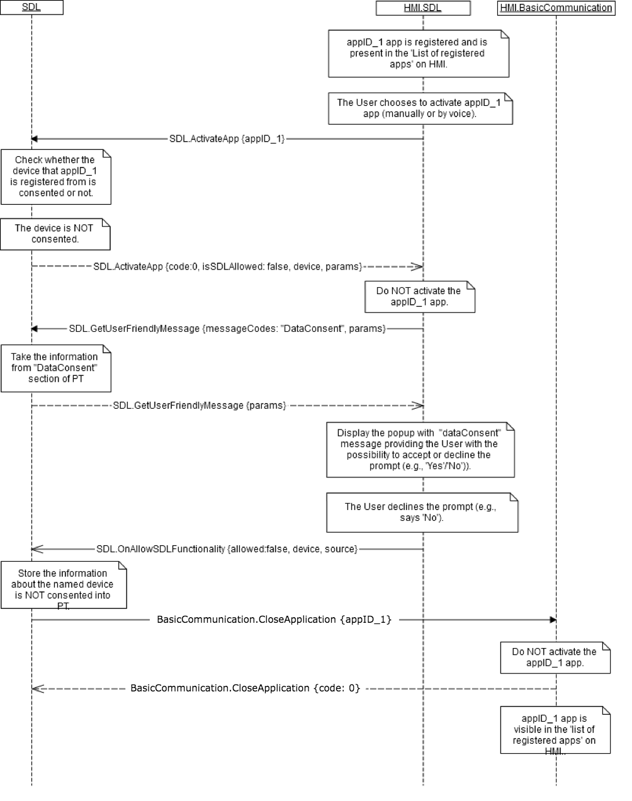

## CloseApplication

Type
: Function

Sender
: HMI

Purpose
: Request to remove the application from the foreground

### Behavior

If the application is in the foreground of the HMI:
!!! must

  1. Remove the application from the foreground.

!!!

SDL will:

1. Place the application in hmiLevel `NONE`

### Request

#### Parameters

|Name|Type|Mandatory|Additional|
|:---|:---|:--------|:---------|
|appID|Integer|true|The application to be removed from the foreground|

### Response

#### Parameters

This RPC has no additional parameter requirements

### JSON Message Examples

#### Example Request

```json
{
  "id" : 47,
  "jsonrpc" : "2.0",
  "method" : "BasicCommunication.ActivateApp",
  "result" :
  {
    "appID" : 65368
  }
}
```

#### Example Response

```json
{
  "id" : 47,
  "jsonrpc" : "2.0",
  "result" :
  {
    "code" : 0,
    "method" : "BasicCommunication.ActivateApp"
  }
}
```

#### Example Error

```json
{
  "id" : 47,
  "jsonrpc" : "2.0",
  "error" :
  {
    "code" : 13,
    "message" : "The provided appID is not valid.",
    "data" :
    {
      "method" : "BasicCommunication.ActivateApp"
    }
  }
}
```

### Sequence Diagrams
|||
Close Application request from mobile application

|||
|||
Close Application after Failed Data Consent Prompt

|||
