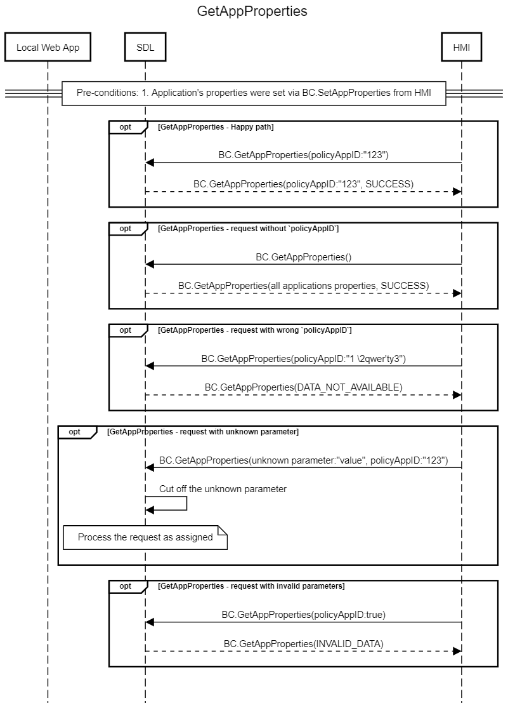

## GetAppProperties

Type
: Function

Sender
: HMI

Purpose
: Get the current properties of an application


### Request

#### Parameters
|Name|Type|Mandatory|Additional|
|:---|:---|:--------|:---------|
|policyAppID|String|false|maxlength: "100"|


### Response
In case `policyAppID` is omitted in the request, SDL provides all app properties in the response.

#### Parameters
|Name|Type|Mandatory|Additional|
|:---|:---|:--------|:---------|
|properties|[Common.AppProperties](../../common/structs/#appproperties)|false|array: true<br>minsize: 1|


### Example Request
```json
{
  "id" : 47,
  "jsonrpc" : "2.0",
  "method" : "BasicCommunication.GetAppProperties",
  "params" :
  {
    "policyAppID" : 123456
  }
}
```

### Example Response

```json
{
  "id" : 47,
  "jsonrpc" : "2.0",
  "result" : {
      "properties": {
          "nicknames":
          {
              "Hello Sdl"
      },
      "policyAppID" : 123456, 
      "enabled": true, 
      "transportType":"WS", 
      "hybridAppPreference": "BOTH"
      },
    "code" : 0,
    "method" : "BasicCommunication.GetAppProperties"
    }
}
```

### Example Error

```json
{
  "id" : 47,
  "jsonrpc" : "2.0",
  "error" :
  {
    "code" : 11,
    "message" : "Invalid data",
    "data" :
    {
      "method" : "BasicCommunication.GetAppProperties"
    }
  }
}
```

### Sequence Diagrams
|||
GetAppProperties

|||
