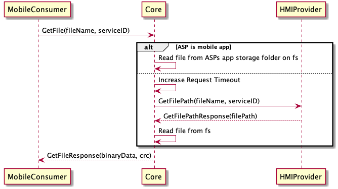

## GetFilePath

Type
: Request

Sender
: SDL

Purpose
: Retrieve a file path from the HMI App Service Provider (ASP)

### Request

#### Parameters

|Name|Type|Mandatory|Additional|
|:---|:---|:--------|:---------|
|fileName|String|true|maxlength: 255|
|fileType|[Common.FileType](../../common/enums/#filetype)|false||
|appServiceId|String|false||


### Response

#### Parameters

|Name|Type|Mandatory|Additional|
|:---|:---|:--------|:---------|
|filePath|String|false||
|fileType|[Common.FileType](../../common/enums/#filetype)|false||

### Sequence Diagrams
|||
GetFile (HMI Provider)

|||

### Example Request

```json
{
  "id": 34,
  "jsonrpc": "2.0",
  "method": "BasicCommunication.GetFilePath",
  "params": {
    "appServiceId": "d712bcaced1260e90f1acf95522dc0ef763bc72f234bcf7672cd7e23801cf150",
    "fileName": "somefile.json",
    "fileType": "JSON"
  }
}
```

### Example Response

```json
{
	"id": 34,
	"jsonrpc": "2.0",
	"result": {
		"method": "BasicCommunication.GetFilePath",
		"code": 0,
		"fileType": "JSON",
		"filePath": "/home/user/HMI/somefile.json"
	}
}
```

### Example Error

```json
{
  "id" : 34,
  "jsonrpc" : "2.0",
  "error" : {
    "code" : 27,
    "message" : "File not found",
    "data" : {
      "method" : "BasicCommunication.GetFilePath"
    }
  }
}
```
