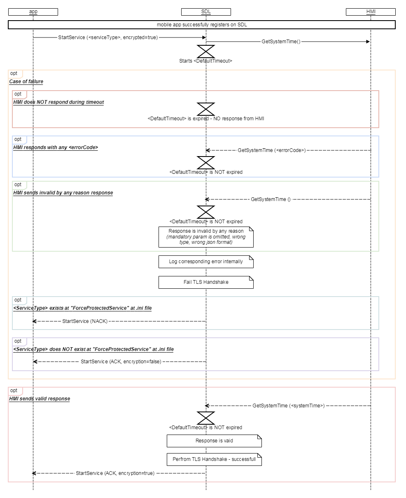

## GetSystemTime

Type
: Function

Sender
: SDL

Purpose
: Obtain current UTC time  

When an application needs to start a protected service with SDL core the app sends a certificate to SDL during the TLS or DTLS handshake process.  
In order to validate the certificate and to check whether this certificate is not expired SDL core needs an accurate UTC system time value.

### Request
SDL sends a GetSystemTime request after receiving a BC.OnSystemTimeReady notification from the HMI.  
After sending the request SDL starts [`<DefaultTimeout>`](https://github.com/smartdevicelink/sdl_hmi_integration_guidelines/blob/develop/docs/Configuration%20file/index.md#main) (value from .ini file) waiting for response from HMI. 

#### Parameters

### Response

!!! must  

1.	Send a valid response during the `<DefaultTimeout>`(value from the smartDeviceLink.ini file)
2.	Provide all parameters of the "DateTime" struct inside of the GetSystemTime response.

!!!

_Note:_ SDL logs the corresponding error internally and fails the handshake process if at least one of the following failures occurs:
1)	HMI does NOT respond during `<DefaultTimeout>`;
2)	HMI responds with any `<errorCode>` during `<DefaultTimeout>`;
3)	HMI sends invalid for any reason in the response:  
    a.	at least one String param is empty (exception: in case empty String param is allowed by HMI_API)  
    b.	at least one String param has '\n', '\t' or completely white-space  
    c.	wrong json format  
    d.	at least one param has invalid type  
    e.	at least one mandatory param was omitted  
    f.	at least one param is out of bounds  


If the handshake process fails, SDL behavior depends on the "ForceProtectedService"/"ForceUnprotectedService" params configured in the 'Security Manager' section of the smartDeviceLink.ini file.

#### Parameters
|Name|Type|Mandatory|Additional|
|:---|:---|:--------|:---------|
|systemTime|[Common.DateTime](docs/Common/Structs/index.md)|true|Current UTC system time|

### Sequence Diagrams
|||
GetSystemTime

|||


### Example Request

```
{
  "id" : 59546,
  "jsonrpc" : "2.0",
  "method" : "BasicCommunication.GetSystemTime"
}
```

### Example Response

```
{
  "id" : 59546,
  "jsonrpc" : "2.0",
  "result" : 
 {
 "systemTime" :
   [
    {
     "millisecond" : 11,
     "second" : 111,
     "minute" : 111,
     "hour" : 11,
     "day" : 1,
     "month" : 11,
     "year" : 2017,
     "tz_hour" : 1,
     "tz_minute" : 11
     }
    ], 
    "code" : 0,
    "method" : "BasicCommunication.GetSystemTime"
  }
}
```

### Example Error  

```json
{
  "id" : 59546,
  "jsonrpc" : "2.0",
  "error" :
  {
    "code" : 11,
    "message" : "Mandatory parameters not provided.",
    "data" :
    {
      "method" : "BasicCommunication.GetSystemTime"
    }
  }
}
```
