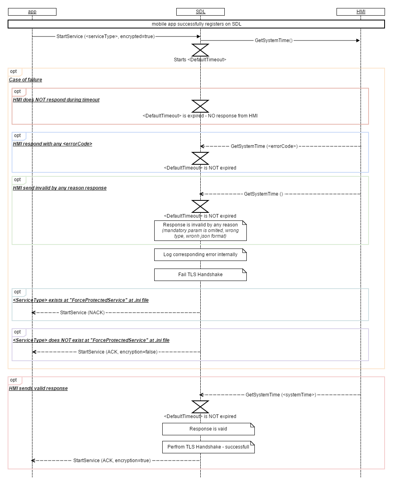

## GeSystemTime

Type
: Function

Sender
: SDL

Purpose
: Obtain current UTC time  

When an application  wants to open protected service it sends certificate to SDL during TLS or DTLS handshake.  
In order to validate the certificate and to check whether this certificate is not expired SDL needs system time.

### Request
SDL sends GetSystemTime request after receiving BC.OnSystemTimeReady from HMI.  
After sending the request SDL starts [`<DefaultTimeout>`](https://github.com/smartdevicelink/sdl_hmi_integration_guidelines/blob/develop/docs/Configuration%20file/index.md#main) (value from .ini file) waiting for response from HMI. 

#### Parameters

### Response

!!! must  

1.	Send valid response during `<DefaultTimeout>`(value from .ini file)
2.	Provide all parameters of "DateTime" struct at response (“milliseconds”,” tz_hour”,” tz_minute” params should be set to “0” as QNX systemTime struct has NO these params)

_Note:_ SDL logs corresponding error internally and fails TLS Handshake if at least one of the following failures happens:
1)	HMI does NOT respond during `<DefaultTimeout>`;
2)	HMI responds with any `<errorCode>` during `<DefaultTimeout>`;
3)	HMI sends invalid by any reason response: 
a.	at least one String param is empty (exception: in case empty String param is allowed by HMI_API)
b.	at least one String param has '\n', '\t' or whitespace_as_only_symbol
c.	wrong json format
d.	at least one param has invalid type
e.	at least one mandatory param was omited
f.	at least one param is out of bound  


In case TLS handshake fails, SDL must behave depending on `<serviceType>` requested for encryption and a value of "ForceProtectedService"/"ForceUnprotectedService" params of .ini file.

#### Parameters
|Name|Type|Mandatory|Additional|
|:---|:---|:--------|:---------|
|systemTime|[Common.DateTime](docs/Common/Structs/index.md)|true|Current UTC system time|

### Sequence Diagrams
|||
GetSystemTime

|||


### Example Request

```
{
	"id" : 59546,
	"jsonrpc" : "2.0",
	"method" : "BasicCommunication. GetSystemTime"
}
```

### Example Response

```
{
	"id" : 59546,
	"jsonrpc" : "2.0",
	"result" : 
	{
      "systemTime" : 
		[
			
			{
				"millisecond" : 11,
				"second" : 111,
				"minute" : 111,
				"hour" : 11,
				"day" : 1,
				"month" : 11,
				"year" : 2017,
                  "tz_hour" : 1,
				"tz_minute" : 11
			}
        ], 
		"code" : 0,
		"method" : "BasicCommunication.GetSystemTime"
	}
}
```

### Example Error  

```  
{
	"id" : 59546,
	"jsonrpc" : "2.0",
	"error" : 
	{
		"code" : 11,
		"message" : " Mandatory parameters not provided ",
		"data" : 
		{
			"method" : "BasicCommunication.GetSystemTime"
		}
	}
}
```