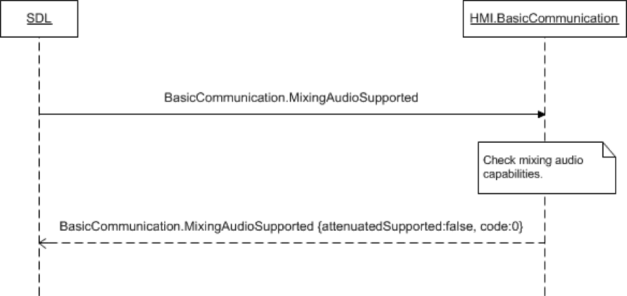

## MixingAudioSupported

Type
: Function

Sender
: SDL

Purpose
: Inform SDL whether the vehicle audio system has the ability to speak the TTS prompts or listen to an recognize VR commands while playing audio

!!! note

SDL is able to get information about the audio mixing capabilities from [smartDeviceLink.ini](https://github.com/smartdevicelink/sdl_core/blob/master/src/appMain/smartDeviceLink.ini). If the request is ignored and there is no record for audio mixing capabilities in smartDeviceLink.ini, SDL will assume mixing audio is not supported.

!!!

### Behavior

!!! must

Check mixing audio capabilities and provided an accurate response.

!!!

### Request

#### Parameters

This RPC has no additional parameter requirements.

### Response

#### Parameters

|Name|Type|Mandatory|Additional|
|:---|:---|:--------|:---------|
|attenuatedSupported|Boolean|true||

### JSON Message Examples

#### Example Request

```json
{
  "id" : 27,
  "jsonrpc" : "2.0",
  "method" : "BasicCommunication.MixingAudioSupported"
}
```

#### Example Response

```json
{
  "id" : 27,
  "jsonrpc" : "2.0",
  "result" :
  {
    "attenuatedSupported" : true,
    "code" : 0,
    "method" : "BasicCommunication. MixingAudioSupported"
  }
}
```

#### Example Error

```json
{
  "id" : 27,
  "jsonrpc" : "2.0",
  "error" :
  {
    "code" : 22,
    "message" : "An unknown error occurred",
    "data" :
    {
      "method" : "BasicCommunication.MixingAudioSupported"
    }
  }
}
```

### Sequence Diagrams
|||
MixingAudioSupported Messaging

|||
