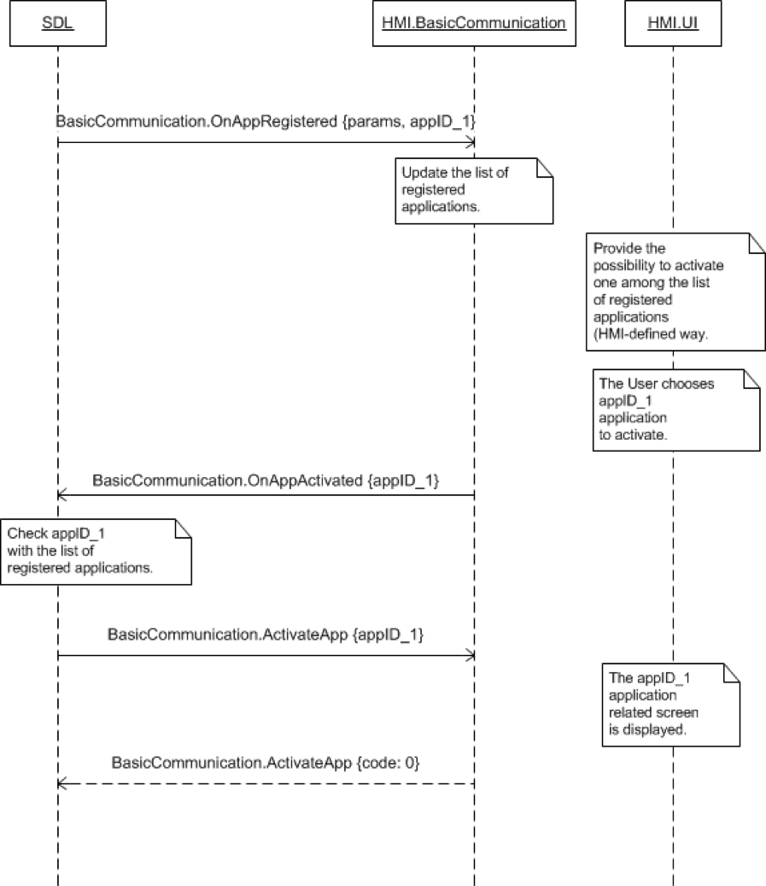

## OnAppActivated

Type
: Notification

Sender
: HMI

Purpose
: Inform SDL that the user has chosen to activate an application.

### Notification

#### Parameters

|Name|Type|Mandatory|Additional|Description|
|:---|:---|:--------|:---------|:----------|
|appID|Integer|true|||

### Sequence Diagrams
|||
User Activates App

|||

#### JSON Example Notification
```json
{
	"jsonrpc" : "2.0",
	"method" : "BasicCommunication.OnAppActivated",
	"params" :
	{
		"appID" : 65544
	}
}
```
