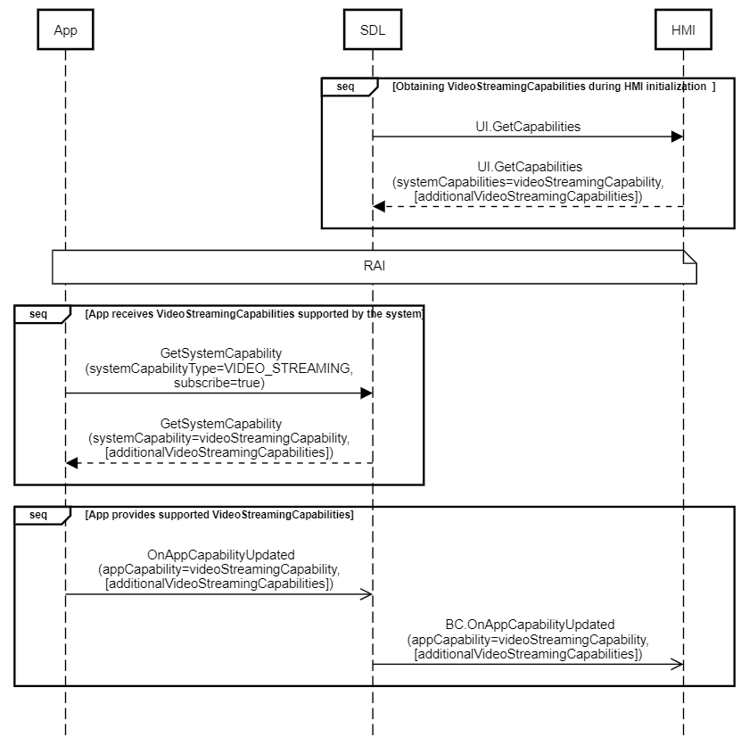

## OnAppCapabilityUpdated

Type
: Notification

Sender
: SDL

Purpose
: Inform that that a specific application capability has changed

### Notification

SDL sends OnAppCapabilityUpdated notification to HMI to provide supported by application <abbr title="Video Streaming Capabilities">VSC</abbr>

!!! may

HMI may switch video streaming resolution according to values provided by application in OnAppCapabilityUpdated notification. (_see also [OnSystemCapabilityUpdated](../OnSystemCapabilityUpdated/index.)_)

If HMI doesn't receive OnAppCapabilityUpdated notification or receives OnAppCapabilityUpdated without `additionalVideoStreamingCapabilities`, HMI should not send OnSystemCapabilityUpdated notification and the user should not be able to change the resolution.
!!!

!!! note

In case older application does not support sending `OnAppCapabilityUpdated` notification, HMI must treat this application as one that does not support dynamic resolution switching and allow only default screen mode for it.

!!!

#### Parameters

|Name|Type|Mandatory|Additional|
|:---|:---|:--------|:---------|
|appCapability|[Common.AppCapability](../../common/structs/#appcapability)|true||
|appID|Integer|true||

### Sequence Diagrams

|||
Negotiation of Video Streaming Capabilities between HMI and Mobile Application

|||


### JSON Message Examples

#### Example Notification

```json
{
   "jsonrpc":"2.0",
   "method":"BasicCommunication.OnAppCapabilityUpdated",
   "params":{
      "appID":65544,
      "appCapability":{
         "appCapabilityType":"VIDEO_STREAMING",
         "videoStreamingCapability":{
            "hapticSpatialDataSupported":false,
            "scale":2.5,
            "additionalVideoStreamingCapabilities":[
               {
                  "scale":1,
                  "hapticSpatialDataSupported":true,
                  "preferredResolution":{
                     "resolutionWidth":800,
                     "resolutionHeight":350
                  }
               },
               {
                  "hapticSpatialDataSupported":false,
                  "preferredResolution":{
                     "resolutionWidth":320,
                     "resolutionHeight":240
                  }
               },
               {
                  "hapticSpatialDataSupported":true,
                  "preferredResolution":{
                     "resolutionWidth":400,
                     "resolutionHeight":480
                  }
               },
               {
                  "hapticSpatialDataSupported":true,
                  "preferredResolution":{
                     "resolutionWidth":640,
                     "resolutionHeight":480
                  }
               },
               {
                  "hapticSpatialDataSupported":true,
                  "preferredResolution":{
                     "resolutionWidth":800,
                     "resolutionHeight":240
                  }
               },
               {
                  "scale":2.5,
                  "hapticSpatialDataSupported":false
               },
               {
                  "scale":5,
                  "hapticSpatialDataSupported":true
               }
            ],
            "preferredResolution":{
               "resolutionWidth":800,
               "resolutionHeight":350
            },
            "diagonalScreenSize":10,
            "maxBitrate":10000,
            "pixelPerInch":150,
            "supportedFormats":[
               {
                  "protocol":"RAW",
                  "codec":"H264"
               }
            ]
         }
      }
   }
```
