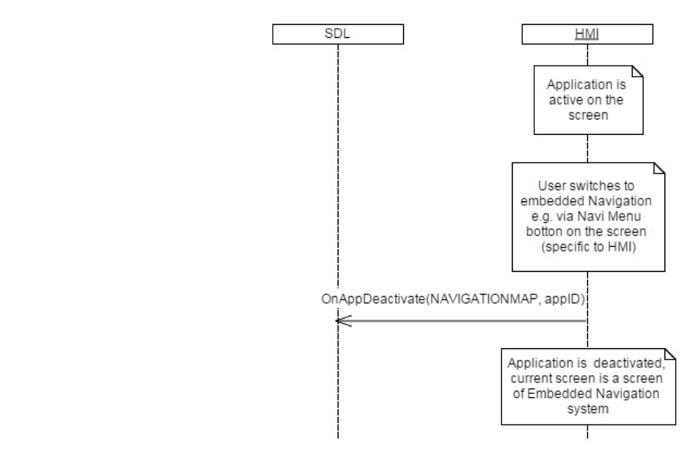

## OnAppDeactivated

Type
: Notification

Sender
: HMI

Purpose
: Inform the application it is no longer active on the HMI

SDL requires this notification in order to keep the mobile application from sending RPC's related to the HMI's functionality (e.g. adding commands for VR, starting an interaction with the user, speaking text via TTS, etc).

!!! MUST

	1. Send an OnAppDeactivated notification when the user has navigated away from the application because of some `DeactivateReason`
	2. Send an OnAppDeactivated (reason="NAVIGATIONMAP") notification when the user switches from the application layout to the embedded navigation screen.
	3. Send an OnAppDeactivated (reason="AUDIO") notification when the user switches to the embedded audio source.
	4. Send an OnAppDeactivated (reason="PHONEMENU") notification when the user switches to the HMI phone menu.

!!!

	In the event a navigation application is in `FULL` or `LIMITED` and the HMI sends `OnAppDeactivated` (reason="NAVIGATIONMAP"), SDL must set the navigation application to `BACKGROUND`.

	In the event a navigation application is in `FULL` or `Limited` and the HMI sends `OnAppDeactivated` (reason="AUDIO"), SDL must set the navigation app to `LIMITED` with the AudioStreamingState set to `AUDIBLE`

!!! NOTE

	The information about the application (name, appID, etc) is provided by SDL via the RPCs `UpdateAppList` or `OnAppRegistered`. SDL ignores all invalid notifications which come from the HMI (invalid JSON, invalid data types/bounds, etc).

!!!

### Notification

#### Parameters

|Name|Type|Mandatory|Additional|
|:---|:---|:--------|:---------|
|appID|Integer|true||
|reason|[Common.DeactivateReason](../../Common/Enums/index.md#deactivatereason)|true||

### Sequence Diagrams
|||
User Switches Apps

|||

#### JSON Example Notification
```json
{
	"jsonrpc" : "2.0",
	"method" : "BasicCommunication.OnAppDeactivated",
	"params" :
	{
		"appID" : 65544,
		"reason" : PHONECALL
	}
}
```
