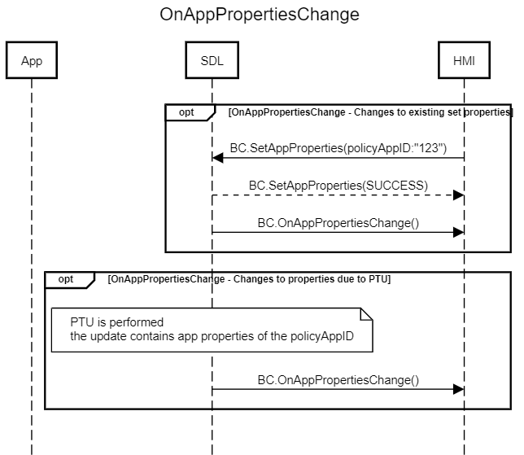

## OnAppPropertiesChange

Type
: Notification

Sender
: SDL

Purpose
: Inform HMI about app properties change

!!! must

SDL must notify the HMI when a web engine app's properties change, such as after a PTU with the appropriate parameters for the web app.

!!!

#### Parameters
|Name|Type|Mandatory|Additional|
|:---|:---|:--------|:---------|
|properties|[Common.AppProperties](../../common/structs/#appproperties)|true||


### Example Notification
```json
{
  "id" : 47,
  "jsonrpc" : "2.0",
  "method" : "BasicCommunication.OnAppPropertiesChange",
  "params" :
  {
    "properties" : {
      "nicknames": ["Hello Sdl1"],
      "policyAppID": "12345678", 
      "enabled": true, 
      "authToken": "AuthToken8888", 
      "transportType": "WS", 
      "hybridAppPreference": "CLOUD"
    }
  }
}
```

### Sequence Diagrams
|||
OnAppPropertiesChange

|||
