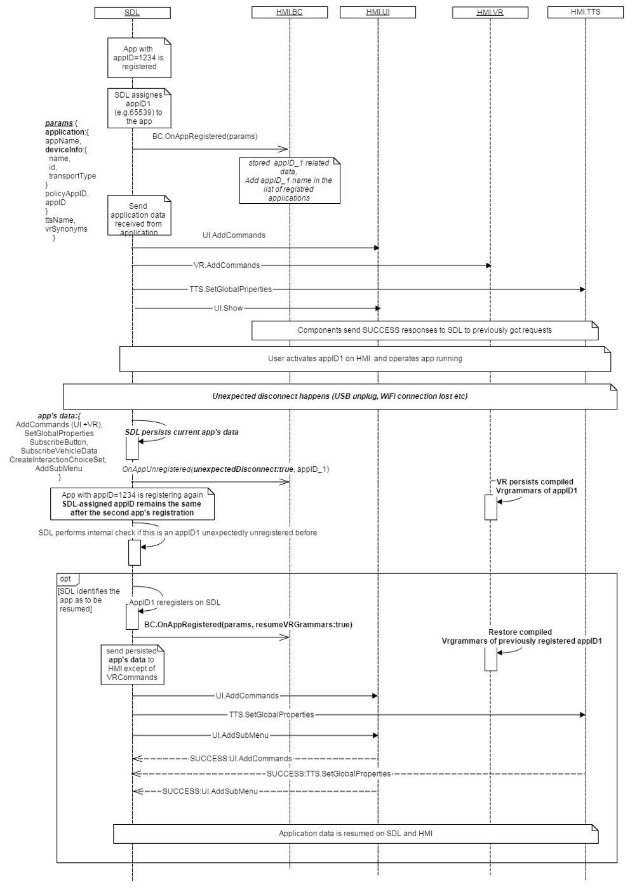
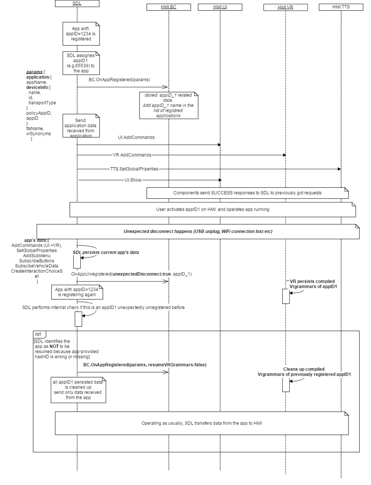
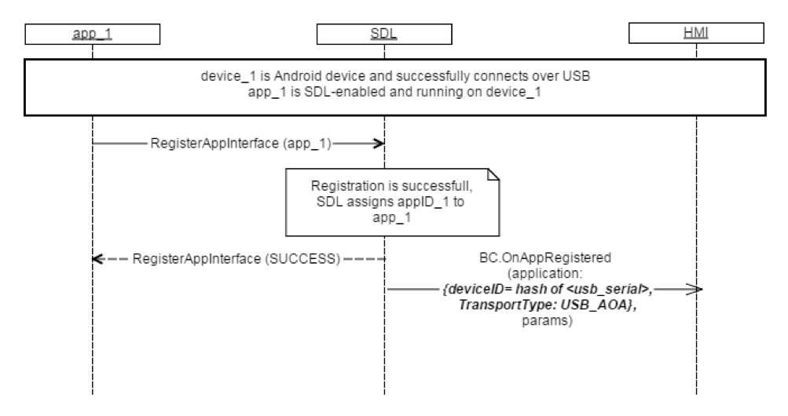
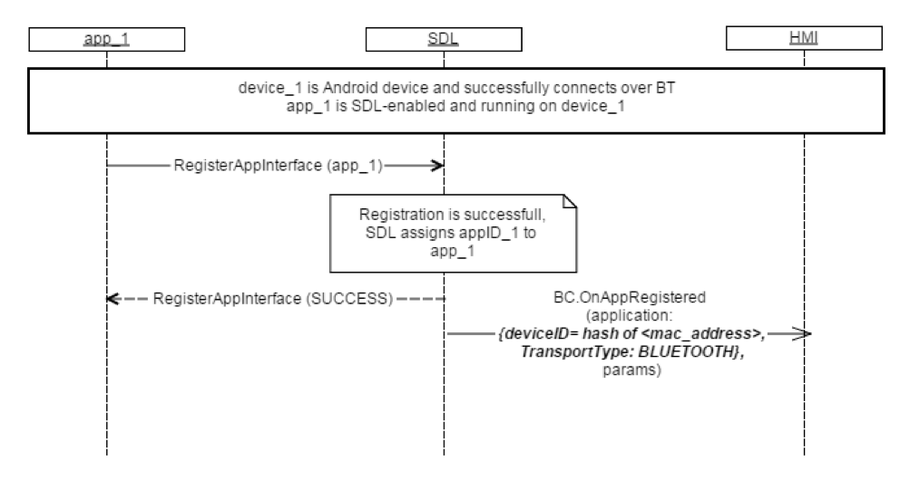
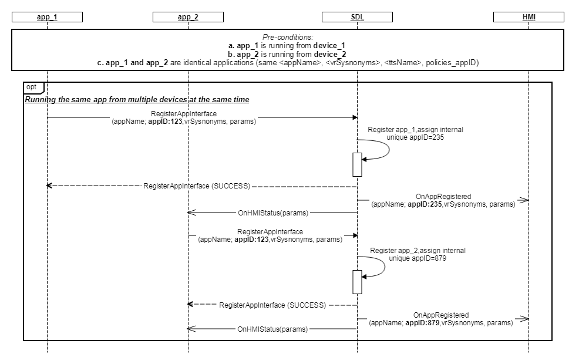

## OnAppRegistered

Type
: Notification

Sender
: SDL

Purpose
: Update the HMI's list of registered applications and resume the Audio Source

SDL will send `OnAppRegistered`:

  1. After an SDL-enabled application has registered successfully.
  2. When the device was reconnected after an unexpected disconnect and a previously connected SDL application reregisters. SDL makes a decision if the data resumption process is applicable for the application.
  3. When the HMI sends an `OnFindApplications` notification via the users request.

Regarding data resumption:

Data resumption means that an application may request to restore data used in the previous ignition cycle after an `Unexpected Disconnect`.


  * For data resumption purposes, SDL must store application-related data such as commands, application global properties, and show data for the past three ignition cycles after an `Unexpected Disconnect` or `Ignition Off`. On the fourth  `Ignition On`, SDL clears all corresponding application-related data used for resumption.
  * HMI must store the VR grammar compiled for applications that are unregistered by an `Unexpected Disconnect` or `Ignition Off`.
  * During data resumption, the HMI may also have to resume the previous audio source. Refer to `BC.OnResumeAudioSource`.

If the application resumes data successfully:

  * SDL will provide `OnAppRegistered` with `resumeVrGrammars`:`true` to notify the HMI that `VRGrammars` must be resumed. On this event, the HMI must restore the application related `VRGgrammars` for the appID received via an `OnAppRegistered` notification.
  * SDL must restore application-related data and send to the HMI after an `OnAppRegistered` notification:
    * `AddCommand`(Menu + VR)
    * `AddSubMenu`
    * `CreateInteractionChoiceSet`
    * `SetGlobalProperties`
    * `SubscribeButton`
    * `SubscibeVehicleData`

If the application does NOT resume data successfully:

  * SDL will provide `OnAppRegistered` with `resumeVrGrammars`:`false` or no resume parameter at all.
  * SDL cleans up all previously stored application data for the application that failed to resume. The HMI must also clean up previously compiled `VRGrammars` for the application.
  * The application will send new data to start SDL operations. In this event, SDL and the HMI should restart the cycle of collecting application data for resumption.

!!! MUST

  1. Update its list of registered applications.
  2. Store the application data sent in the `applications` parameter.
  3. Compile and store `VRGrammars` for the `vrSynonyms` parameter, and arrange them for the user to be able to use via voice recognition. Note: The VR commands to activate an application must be accessible when viewing a different active application or the list of registered applications.
  4. Provide the user with the possibility to choose an application among a list of registered applications.
  5. Send an `OnAppActivated` notification to SDL when the user activates an app via the `UI` or `VR`.   
  6. Manage application events by priority. HMI gets proirity information from _OnAppRegistered_, _UpdateAppList_, _ActivateApp_ HMI API.  
  7. HMI must set app icon and create the app title in the mobile apps list in case SDL provides `<icon>` via `OnAppRegistered` notification.  
  8. HMI must set default app icon in case SDL omits `<icon>` at `OnAppRegistered` notification.  
  9. Differentiate the same app across different devices.
!!!

!!! NOTE   
   * If a device is connected over USB and registers an application, SDL will send `OnAppRegistered` with a hash of the usb serial number as the device id.
   * If a device is connected over Bluetooth or Wi-Fi and registers an application, SDL will send `OnAppRegistered` with a hash of the device's mac address as the device id.
   * When the application is registered for the first time (no records in PT) PoliciesManager should not initiate prompting the User about the event.  
   * If iOS device was connected over Bluetooth with applications registered and running on SDL and was also connected over USB, SDL must start reconnection timer and NOT send OnAppRegistered to HMI.
!!!

!!! NOTE
SDL Apps that are using the websocket transport adapter will send `OnAppRegistered` after the user has activated the app and the websocket connection is opened. The HMI should not use `OnAppRegistered` for updating the available apps in the app list. [BC.UpdateAppList](../UpdateAppList) should be used for updating the app list. 
!!!


### Notification

#### Parameters

|Name|Type|Mandatory|Additional|
|:---|:---|:--------|:---------|
|application|[Common.HMIApplication](../../common/structs/#hmiapplication)|true||
|ttsName|[Common.TTSChunk](../../common/structs/#ttschunk)|false|array: true<br>minsize: 1<br>maxsize: 100|
|vrSynonyms|String|false|array: true<br>minsize: 1<br>maxsize: 100<br>maxlength: 40 <br> Must not interfere with any name of previously registered applications from the same device.|
|resumeVrGrammars|Boolean|false||
|priority|[Common.AppPriority](../../common/enums/#apppriority)|false||

### Sequence Diagrams
|||
App Register with Resume

|||
|||
App Register without Resume

|||
|||
App Registers on USB

|||
|||
App Registers on Bluetooth

|||
|||
Running the same apps from multiple devices at the same time

|||

### Example Notification
```json
{
	"jsonrpc": "2.0",
	"method": "BasicCommunication.OnAppRegistered",
	"params": {
	  "application": {
			"appName": "TryMe",
			"ngnMediaScreenAppName": "TryMe",
			"deviceInfo": {
				"name": "GT-I9300",
				"id": 1563462,
				"transportType": "BLUETOOTH"
			},
			"policyAppID": 123,
			"appID": 65540,
			"hmiDisplayLanguageDesired": "ES-ES",
			"isMediaApplication": false
		},
		"resumeVRGrammars": true
	}
}
```

#### Cloud App Example Notification

```json
{
  "jsonrpc": "2.0",
  "method": "BasicCommunication.OnAppRegistered",
  "params": {
    "application": {
      "appID": 845030685,
      "appName": "SDL App",
      "appType": [
        "DEFAULT"
      ],
      "cloudConnectionStatus": "CONNECTED",
      "dayColorScheme": {
        "backgroundColor": {
          "blue": 98,
          "green": 78,
          "red": 36
        },
        "primaryColor": {
          "blue": 248,
          "green": 246,
          "red": 242
        },
        "secondaryColor": {
          "blue": 98,
          "green": 78,
          "red": 36
        }
      },
      "deviceInfo": {
        "id": "1d92c1e33853c4566641d26e7043e7646da2a4d4a2fa0f99687fdf75f7f40a93",
        "isSDLAllowed": true,
        "name": "ws://192.168.1.69:3000/",
        "transportType": "CLOUD_WEBSOCKET"
      },
      "hmiDisplayLanguageDesired": "EN-US",
      "isCloudApplication": true,
      "isMediaApplication": false,
      "ngnMediaScreenAppName": "SDLApp",
      "nightColorScheme": {
        "backgroundColor": {
          "blue": 35,
          "green": 17,
          "red": 2
        },
        "primaryColor": {
          "blue": 248,
          "green": 246,
          "red": 242
        },
        "secondaryColor": {
          "blue": 98,
          "green": 78,
          "red": 36
        }
      },
      "policyAppID": "123456",
      "requestSubType": [],
      "requestType": [],
      "vrSynonyms": [
        "SDLApp"
      ]
    },
    "priority": "NONE",
    "vrSynonyms": [
      "SDLApp"
    ]
  }
}
```
