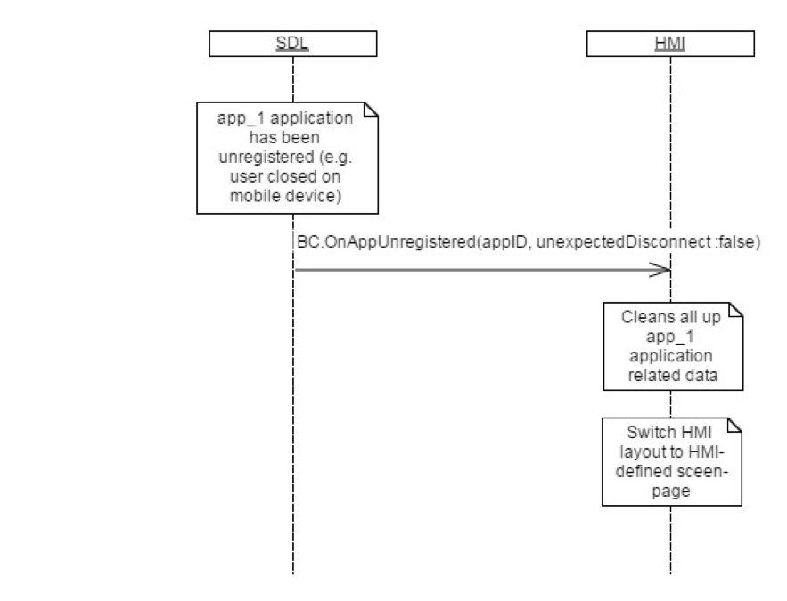

## OnAppUnregistered

Type
: Notification

Sender
: SDL

Purpose
: Inform the HMI that an application has unregistered.

SDL sends this notification when:

  1. The named application has unregistered from the mobile side via an appropriate RPC.
  2. The connection and corresponding session(s) are closed due to transport connection issues (for example, WiFi/<abbr title="Bluetooth">BT</abbr> connection closing on mobile device, USB unplugging, etc.).
  3. A HeartBeat timeout occurs between the mobile device and SDL Core (if a HeartBeat timeout is set).

!!! MUST

  1. HMI must distinguish between an unexpected disconnect and a regular exit from the `unexpectedDisconnect` parameter.
  2. HMI must removed the named application from the list of registered applications.

!!!

!!! MAY

  1. In case of an `Unexpected Disconnect`, the HMI may display a popup of some kind that reports a connection with the named app was unexpectedly lost.
  2. In case of any type of disconnect, the HMI may switch to a `Home` screen that displays a list of other registered applications.
  3. The HMI may delete all application data after an app disconnects, except for `VRGrammars`.

!!!

!!! NOTE

Information about the application (name, appID, etc) is provided by SDL via [BC.UpdateAppList](../updateapplist) or [BC.OnAppRegistered](../onappregistered).

!!!

### Notification

#### Parameters

|Name|Type|Mandatory|Additional|
|:---|:---|:--------|:---------|
|unexpectedDisconnect|Boolean|true||
|appID|Integer|true||

### Sequence Diagrams

|||
Active App Unregistered

|||

### JSON Message Examples

#### Example Notification

```json
{
  "jsonrpc" : "2.0",
  "method" : "BasicCommunication.OnAppUnregistered",
  "params" :
  {
    "appID" : 65539,
      "unexpectedDisconnect": false
  }
}
```
