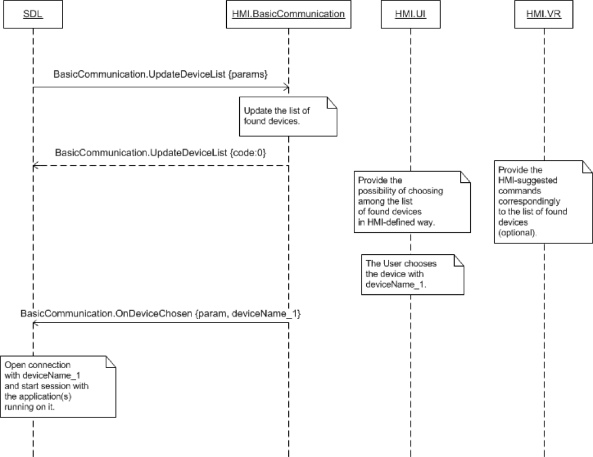

## OnDeviceChosen

Type
: Notification

Sender
: HMI

Purpose
: Open the connection with the named device

On Receipt of this notification SDL will open the connected with the named device and start sessions with the compatible SDL applications running on the device.

!!! must

  1. Provide the user with the possibility to choose among the list of known devices
  2. Send this RPC when the user has selected the device

!!!

!!! note

The list of known devices is provided to the HMI in the [UpdateDeviceList](../UpdateDeviceList) Request.

!!!

### Notification

#### Parameters

|Name|Type|Mandatory|Additional|Description|
|:---|:---|:--------|:---------|:----------|
|deviceInfo|Common.DeviceInfo|true||The information about the device chosen by the User|

#### DeviceInfo

|Name|Type|Mandatory|Additional|Description|
|:---|:---|:--------|:---------|:----------|
|name|String|true||The name of the device connected|
|id|String|true||The ID of the device connected.  Either a hash of device's USB serial number (in case of USB connection) or hash of device's MAC address (in case of BlueTooth or WiFi connection). Remains unique between the ignition cycles for the same transport type.|
|transportType|Common.TransportType|false||The transport type the device is connected over to SDL (BlueTooth, USB or WiFi). Always returned by SDL via OnAppRegistered and UpdateAppList RPCs.|
|isSDLAllowed|Boolean|false||Sent by SDL in UpdateDeviceList. ’true’ – if device is allowed for PolicyTable Exchange; ‘false’ – if device is NOT allowed for PolicyTable Exchange|

### Example Notification
```json
{
	"jsonrpc" : "2.0",
	"method" : "BasicCommunication.OnDevcieChosen",
	"params" :
	{
		"deviceInfo" :
		{
				"name" : "Jerry`s Phone",
				"id" : 3
		}
	}
}
```

### Sequence Diagrams
#### OnDeviceChosen

