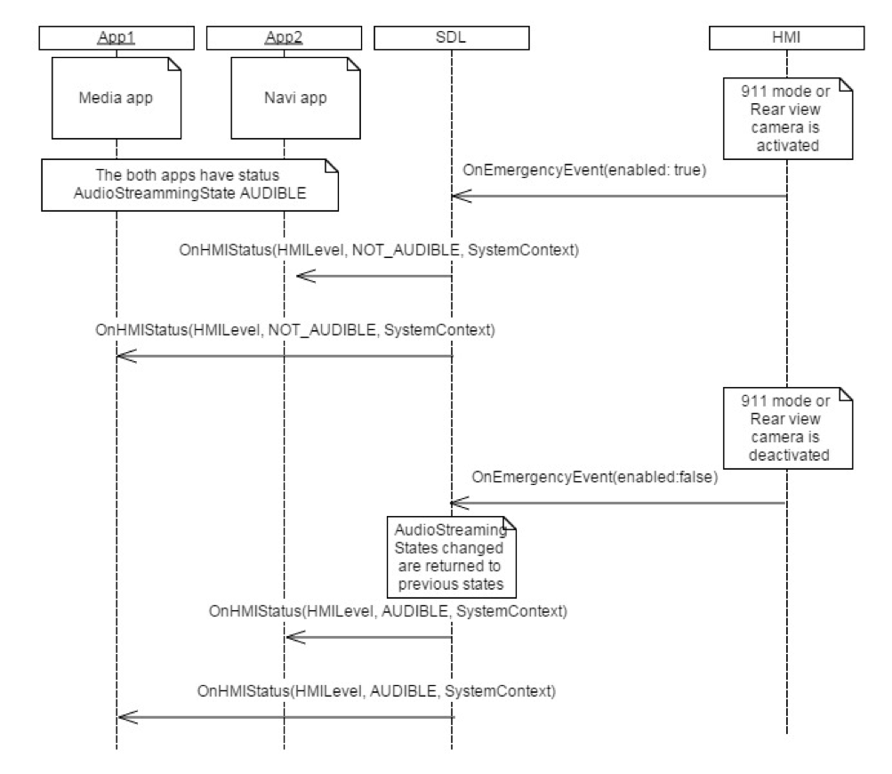

## OnEmergencyEvent

Type
: Notification

Sender
: HMI

Purpose
: Inform SDL to change all AUDIBLE apps to NOT_AUDIBLE and back.


### Notification

#### Parameters

|Name|Type|Mandatory|Additional|
|:---|:---|:--------|:---------|
|enabled|Boolean|true||

### Sequence Diagrams
|||
Emergency Event Activated

|||

#### JSON Example Notification
```json
{
	"jsonrpc" : "2.0",
	"method" : "BasicCommunication. OnEmergencyEvent"
     "params" :
	{
				"enabled" : "true"

	}

}
```
