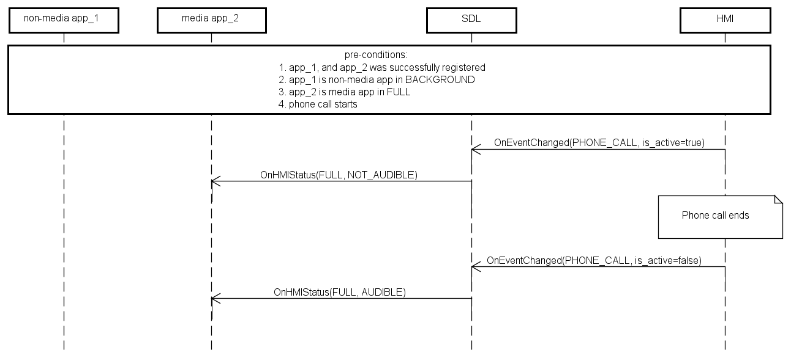

## OnEventChanged

Type
: Notification

Sender
: HMI

Purpose
: Notify SDL that an event becomes active

SDL uses `OnEventChanged` notification for correct changing HMILevels and AudioStreamingState of applications due to active events.

**Phone call**

!!! must

1.	Send notification with appropriate parameter value when active call on HMI has been started/ended.

2.	Send SDL OnAppDeactivated `<appID>` after the phone call started.

3.	Resume the applications to the previous-to-phone-call state on HMI (as SDL does not send BC.ActivateApp or BC.OnResumeAudioSource to HMI after the phone call is ended).

_Note:_  When SDL receives OnEventChanged(PHONE_CALL, isActive: true) from HMI,  
it changes the HMILevel of all applications currently either in FULL or LIMITED to BACKGROUND, audioStreamingState: NOT_AUDIBLE.  
After getting OnEventChanged(PHONE_CALL, isActive: false) from HMI, SDL returns applications to the previous-to-phonecall HMILevel.  
SDL does not send BC.ActivateApp or BC.OnResumeAudioSource to HMI after the phone call is ended.  

**Emergency event**

Safety Feature is HMI`s specific mode when 'Emergency event' or 'Rear view camera' are active modes.  
The main idea from SDL<->HMI point of view is that navigation/audio streaming mustn't interfere with Rear Camera View mode. HMI is responsible for managing audio/video data during �Emergency event�/�RearCamera� modes.

!!! must  

1. 	Send notification with appropriate parameter value when mode 'Emergency event'/'Rear view camera' becomes active or inactive.

_Note:_
When SDL receives OnEventChanged(EMERGENCY_EVENT isActive:true) notification about SafetyFeature activation from HMI,  
SDL moves all apps with AudioStreamingState AUDIBLE to NOT_AUDIBLE state and returns to previous state when gets `OnEventChanged(EMERGENCY_EVENT isActive:false)`.  
The app is not allowed to stream audio and it will not be heard by the user (due to other audio and/or system events blocking it).  

**Deactivate HMI**  

!!! must  

1.	Send notification with appropriate parameter value when all apps to be inactivated/restored.
2.	Send `OnEventChange (DEACTIVATE_HMI isDeactivated: false)` before activating an app.  

_Note:_ When SDL receives OnEventChange(DEACTIVATE_HMI isDeactivated: true) from HMI, it changes the HMILevel of all applications currently in FULL and-or LIMITED to BACKGROUND, audioStreamingState: NOT_AUDIBLE. After getting OnEventChange (DEACTIVATE_HMI isDeactivated: false) from HMI, SDL resumes the applications to the previous-to-event state on HMI.  

**Audio source and Embedded navi**

!!! must
1.	Send notification to SDL with appropriate parameter value when embedded navigation or audio source is activated/deactivated.
2.	Send SDL.ActivateApp (`<appID>`) in case of app activation or OnAppDeactivated (`<appID>`) in case of app deactivation.
3.	Switch off embedded source before app activation, when the type of activating app and embedded source are the same.  

_Note:_

When app is successfully registered and SDL receives OnEventChanged(AUDIO_SOURCE, isActive:true) or OnEventChanged(EMBEDDED_NAVI, isActive:true), SDL changes HMILevel and AudioStreamingState of this application. (see the table _HMILevel and audioStreamingState of apps when embedded audio source or navigation was activated_) 

When app is activated during active embedded navi or audio source SDL sets appropriate HMILevel and AudioStreamingState  (see the table _Apps activation during active embedded audio source or navigation_)  

#### HMILevel and audioStreamingState of apps when embedded audio source or navigation was activated
|appHMIType|HMILevel before embedded source activation|embedded source activation|HMILevel during active embedded source|
|:---|:---|:--------|:---------|
|media|FULL or LIMITED and AUDIBLE|embedded audio source|BACKGROUND and NOT_AUDIBLE|
|navigation|FULL or LIMITED and AUDIBLE|embedded audio source|LIMITED and AUDIBLE
|non-media|FULL or LIMITED and AUDIBLE|embedded audio source|BACKGROUND and NOT_AUDIBLE|
|media|FULL or LIMITED and AUDIBLE|embedded navigation|LIMITED and AUDIBLE|
|navigation|FULL or LIMITED and AUDIBLE|embedded navigation|BACKGROUND and NOT_AUDIBLE|
|non-media|FULL or LIMITED and AUDIBLE|embedded navigation|BACKGROUND and NOT_AUDIBLE|

#### Apps activation during active embedded audio source or navigation
|appHMIType|active embedded source|App activation|
|:---|:---|:--------|
|media|embedded audio source|FULL and AUDIBLE (embedded audio source should be switched off)
|navigation|embedded audio source|FULL and AUDIBLE (embedded audio source still active)
|non-media|embedded audio source|FULL and NOT_AUDIBLE (embedded audio source still active)
|media|embedded navigation|FULL and AUDIBLE (embedded navigation is still active)
|navigation|embedded navigation|FULL and AUDIBLE (embedded navigation should be switched off)
|non-media|embedded navigation|FULL and NOT_AUDIBLE (embedded navigation still active) 


#### Parameters

|Name|Type|Mandatory|Additional|Description
|:---|:---|:--------|:--------|:---------|
|eventName|Common.EventTypes|true|-|	Specifies the types of active events
|isActive|Boolean|true|	-	|Must be 'true' - when the event is started on HMI. Must be 'false' when the event is ended on HMI

### Sequence Diagrams
|||
PHONE_CALL


|||
EMERGENCY_EVENT

|||
DEACTIVATE_HMI

|||
EMBEDDED_NAVI or AUDIO_SOURCE

|||

#### JSON Example Notification

```json
{
  "jsonrpc" : "2.0",
  "method" : "OnEventChanged",
  "params" :
  {
    "eventName" : PHONE_CALL
"isActive"  : true
  }

}
```


