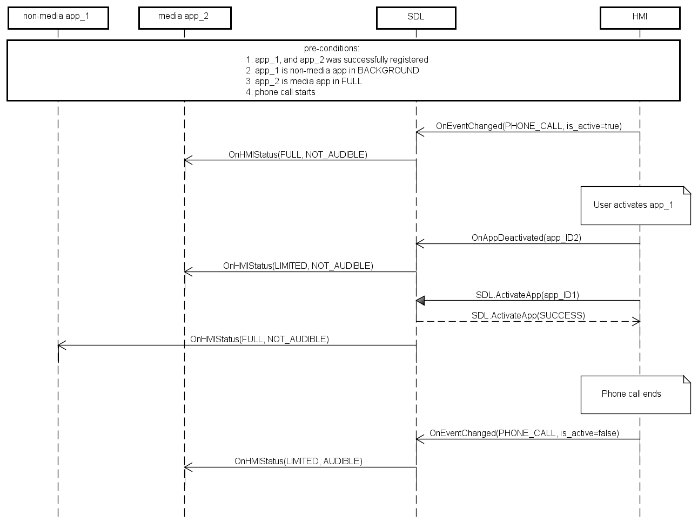

## OnEventChanged

Type
: Notification

Sender
: HMI

Purpose
: Notify SDL that an event becomes active or inactive

SDL uses `OnEventChanged` notification to appropriately manage the hmiLevel and audioStreamingState of each application during an active event.

### Event Types

#### PHONE_CALL

!!! MUST
1. Send notification with appropriate parameter value when active call on HMI has been started/ended.

2. Send [SDL.OnAppDeactivated](../../sdl/onappdeactivated) to the active app when the phone call is started.

3. Resume the applications to their original state prior to the phone call event in the HMI when the event ends (see note below).
!!!

!!! NOTE
SDL does not send BC.ActivateApp or BC.OnResumeAudioSource to HMI after the phone call is ended.
!!!

Upon receiving `OnEventChanged(PHONE_CALL)`, SDL will:

|isActive|Result|
|:-------|:-----|
|true|Change the HMI state of all media applications currently either in FULL or LIMITED to (BACKGROUND, NOT_AUDIBLE) and all navi/projection apps to (LIMITED, NOT_AUDIBLE, STREAMABLE)|
|false|Remove all HMI state modifications that were applied during the event from each application|

#### EMERGENCY_EVENT

EMERGENCY_EVENT is an HMI-specific event used when "Emergency event" or "Rear view camera" are active. The main idea of this from the SDL<->HMI point of view is that navigation/audio streaming mustn't interfere with Rear Camera View mode. The HMI is responsible for managing audio/video data while EMERGENCY_EVENT is active.

!!! MUST
1. Send a notification with the appropriate parameter value when EMERGENCY_EVENT becomes active or inactive.
!!!

Upon receiving `OnEventChanged(EMERGENCY_EVENT)`, SDL will:

|isActive|Result|
|:-------|:-----|
|true|Move all apps with audioStreamingState AUDIBLE or STREAMABLE to NOT_AUDIBLE and NOT_STREAMABLE|
|false|Remove all HMI state modifications that were applied during the event from each application|

!!! NOTE
While the event is active, the app is not allowed to stream audio and it will not be heard by the user (due to other audio and/or system events blocking it).
!!!

#### DEACTIVATE_HMI

!!! MUST
1. Send notification with appropriate parameter value when all apps should be deactivated/restored.
2. Send `OnEventChanged(DEACTIVATE_HMI, isActive: false)` before activating an app.
!!!

Upon receiving `OnEventChanged(DEACTIVATE_HMI)`, SDL will:

|isActive|Result|
|:-------|:-----|
|true|Change the hmiLevel of all applications currently in (FULL/LIMITED) to (BACKGROUND, NOT_AUDIBLE, NOT_STREAMABLE)|
|false|Remove all HMI state modifications that were applied during the event from each application|

!!! NOTE
When this event is active, SDL **rejects** all app activation requests from the HMI.
!!!

#### AUDIO_SOURCE/EMBEDDED_NAVI

!!! MUST
1. Send notification to SDL with appropriate parameter value when embedded navigation or audio source is activated/deactivated.
2. Send `SDL.ActivateApp(appID)` in case of app activation or `BC.OnAppDeactivated(appID)` in case of app deactivation.
3. Switch off embedded source before app activation, when the type of activating app and embedded source are the same:
    - The HMI must deactivate the AUDIO_SOURCE event if a media app is activated.
    - The HMI must deactivate the EMBEDDED_NAVI event if a navigation app is activated.
4. When the system supports audio mixing and embedded navigation starts streaming
    - Send TTS.Started to SDL to change media app currently in (LIMITED, AUDIBLE) to (LIMITED, ATTENUATED) due to active embedded navigation.
    - Send TTS.Stopped to SDL right after embedded navigation stops streaming to remove any HMI state modifications that were applied during the event.
!!!

!!! NOTE
- When app is successfully registered and SDL receives `OnEventChanged(AUDIO_SOURCE, isActive:true)` or `OnEventChanged(EMBEDDED_NAVI, isActive:true)`, SDL changes hmiLevel and audioStreamingState of this application.
    - See the table _HMI Status of apps when AUDIO_SOURCE or EMBEDDED_NAVI event is activated_

- When app is activated during an active EMBEDDED_NAVI or AUDIO_SOURCE event, SDL sets the appropriate hmiLevel and audioStreamingState for the app.
    - See the table _Activating apps during active AUDIO_SOURCE or EMBEDDED_NAVI event_

- Given that a system supports audio mixing ("MixingAudioSupported" = true at .ini file), then:
    - If there is a navigation app in (FULL/LIMITED, AUDIBLE, STREAMABLE) and SDL receives `OnEventChanged(AUDIO_SOURCE, isActive=true)`, then SDL will change the navigation app's state to (LIMITED, AUDIBLE, STREAMABLE)
    - If there is a navigation app that is in (LIMITED, AUDIBLE, STREAMABLE) due to an active AUDIO_SOURCE event, and SDL receives `SDL.ActivateApp(appID_of_navigation_app)`, then SDL will change the navigation app's state to (FULL, AUDIBLE, STREAMABLE).
    - If SDL receives `OnEventChanged(EMBEDDED_NAVI, isActive=true)`, SDL changes any media app in (LIMITED, AUDIBLE) to (LIMITED, ATTENUATED). After the EMBEDDED_NAVI event ends, SDL changes the media app's state to (LIMITED, AUDIBLE).
!!!

##### HMI Status of apps when `AUDIO_SOURCE` or `EMBEDDED_NAVI` event is activated

|appHMIType|Event|HMI State before|HMI State after|
|:---------|:----|:---------------|:--------------|
|Media|AUDIO_SOURCE|(FULL/LIMITED, AUDIBLE, NOT_STREAMABLE)|(BACKGROUND, NOT_AUDIBLE, NOT_STREAMABLE)|
|Navigation|AUDIO_SOURCE|(FULL/LIMITED, AUDIBLE, STREAMABLE)|(LIMITED, AUDIBLE, STREAMABLE)|
|Projection|AUDIO_SOURCE|(FULL/LIMITED, AUDIBLE, STREAMABLE)|(LIMITED, AUDIBLE, STREAMABLE)|
|Projection+Media|AUDIO_SOURCE|(FULL/LIMITED, AUDIBLE, STREAMABLE)|(LIMITED, NOT_AUDIBLE, STREAMABLE)|
|Communication|AUDIO_SOURCE|(FULL/LIMITED, AUDIBLE, NOT_STREAMABLE)|(LIMITED, AUDIBLE, NOT_STREAMABLE)|
|Non-media|AUDIO_SOURCE|(FULL/LIMITED, NOT_AUDIBLE, NOT_STREAMABLE)|(BACKGROUND, NOT_AUDIBLE, NOT_STREAMABLE)|
|Media|EMBEDDED_NAVI|(FULL/LIMITED, AUDIBLE, NOT_STREAMABLE)|(LIMITED, AUDIBLE, NOT_STREAMABLE)|
|Navigation|EMBEDDED_NAVI|(FULL/LIMITED, AUDIBLE, STREAMABLE)|(BACKGROUND, NOT_AUDIBLE, NOT_STREAMABLE)|
|Projection|EMBEDDED_NAVI|(FULL/LIMITED, NOT_AUDIBLE, STREAMABLE)|(BACKGROUND, NOT_AUDIBLE, NOT_STREAMABLE)|
|Projection+Media|EMBEDDED_NAVI|(FULL/LIMITED, AUDIBLE, STREAMABLE)|(LIMITED, AUDIBLE, NOT_STREAMABLE)|
|Communication|EMBEDDED_NAVI|(FULL/LIMITED, AUDIBLE, NOT_STREAMABLE)|(LIMITED, AUDIBLE, NOT_STREAMABLE)|
|Non-media|EMBEDDED_NAVI|(FULL/LIMITED, NOT_AUDIBLE, NOT_STREAMABLE)|(BACKGROUND, NOT_AUDIBLE, NOT_STREAMABLE)|

##### Activating apps during active `AUDIO_SOURCE` or `EMBEDDED_NAVI` event

|appHMIType|Event|New HMI State|Keep event active|
|:---------|:----|:------------|:----------------|
|Media|AUDIO_SOURCE|(FULL, AUDIBLE, NOT_STREAMABLE)|false|
|Navigation|AUDIO_SOURCE|(FULL, AUDIBLE, STREAMABLE)|true|
|Projection|AUDIO_SOURCE|(FULL, NOT_AUDIBLE, STREAMABLE)|true|
|Projection+Media|AUDIO_SOURCE|(FULL, AUDIBLE, STREAMABLE)|true|
|Non-media|AUDIO_SOURCE|(FULL, NOT_AUDIBLE, NOT_STREAMABLE)|true|
|Media|EMBEDDED_NAVI|(FULL, AUDIBLE, NOT_STREAMABLE)|true|
|Navigation|EMBEDDED_NAVI|(FULL, AUDIBLE, STREAMABLE)|false|
|Projection|EMBEDDED_NAVI|(FULL, NOT_AUDIBLE, STREAMABLE)|true|
|Projection+Media|EMBEDDED_NAVI|(FULL, AUDIBLE, STREAMABLE)|true|
|Non-media|EMBEDDED_NAVI|(FULL, NOT_AUDIBLE, NOT_STREAMABLE)|true|

### Notification

#### Parameters

|Name|Type|Mandatory|Additional|Description|
|:---|:---|:--------|:--------|:---------|
|eventName|[Common.EventTypes](../../common/enums/#eventtypes)|true||Specifies the types of active events|
|isActive|Boolean|true||Must be 'true' when the event is started on HMI. Must be 'false' when the event is ended on HMI|

### Sequence Diagrams

|||
PHONE_CALL, media app is active

|||

|||
PHONE_CALL, non-media app is active

|||

|||
EMERGENCY_EVENT

|||

|||
DEACTIVATE_HMI

|||

|||
EMBEDDED_NAVI or AUDIO_SOURCE

|||

|||
App activation during active audio source

|||

|||
App activation during active embedded navigation

|||

|||
Correlation between audioStreamingState of media app and embedded navigation in case "MixingAudioSupported" = true/false

|||

|||
Multiple apps activation during active embedded navigation or audio source

|||

### JSON Message Examples

#### Example Notification

```json
{
  "jsonrpc" : "2.0",
  "method" : "BasicCommunication.OnEventChanged",
  "params" :
  {
    "eventName" : "PHONE_CALL",
    "isActive" : true
  }

}
```
