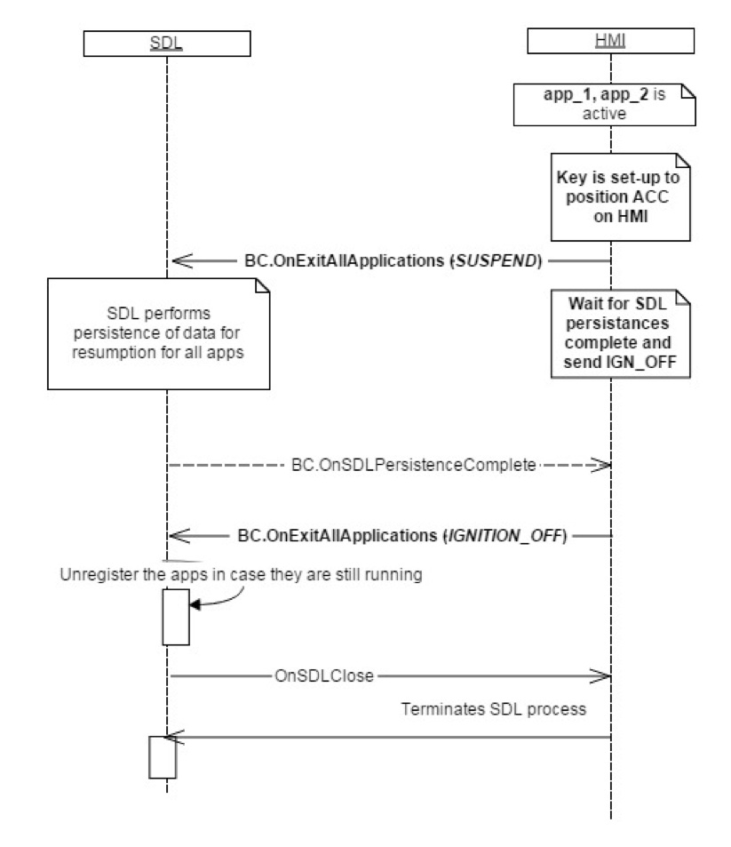

## OnExitAllApplications

Type
: Notification

Sender
: HMI

Purpose
: Inform SDL to exit every registered application.

SDL requires this notification in order to accurately close the sessions with registered applications before reloading or shutting down based on the user's actions.

!!! MUST

  * Send `OnExitAllApplications` with the appropriate `reason` upon one of the users's actions:
    * Master Reset
    * Key set to Ignition Off (Refer to the diagram below).
    * Key set to Suspend (Refer to the diagram below).
    * Key set to ACC

!!!

### Notification

#### Parameters

|Name|Type|Mandatory|Additional|
|:---|:---|:--------|:---------|
|reason|[Common.ApplicationsCloseReason](../../common/enums/#applicationsclosereason)|true||

### Sequence Diagrams

|||
Exit All Apps on Ignition Off

|||

### JSON Message Examples

#### Example Notification

```json
{
  "jsonrpc" : "2.0",
  "method" : "BasicCommunication.OnExitAllApplications",
  "params" :
  {
    "reason" : "IGNITION_OFF"
  }
}
```
