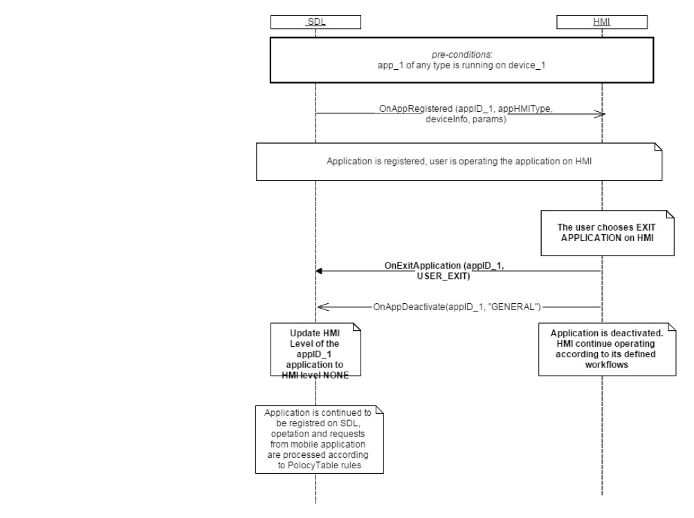

## OnExitApplication

Type
: Notification

Sender
: HMI

Purpose
: Inform SDL that an application must be unregistered or put into the NONE HMI state.

### Notification

#### Parameters

|Name|Type|Mandatory|Additional|
|:---|:---|:--------|:---------|
|reason|[Common.ApplicationToNONEReason](../../Common/Enums/index.md#applicationtononereason)|true||
|appID|Integer|true||

### Sequence Diagrams
|||
User Exits Application

|||
|||
Application Not Authorized

|||

#### JSON Example Notification
```json
{
	"jsonrpc" : "2.0",
	"method" : "BasicCommunication.OnExitApplication",
	"params" :
	{
		"appID" : 65544,
		"reason" : "USER_EXIT"
	}
}
```
