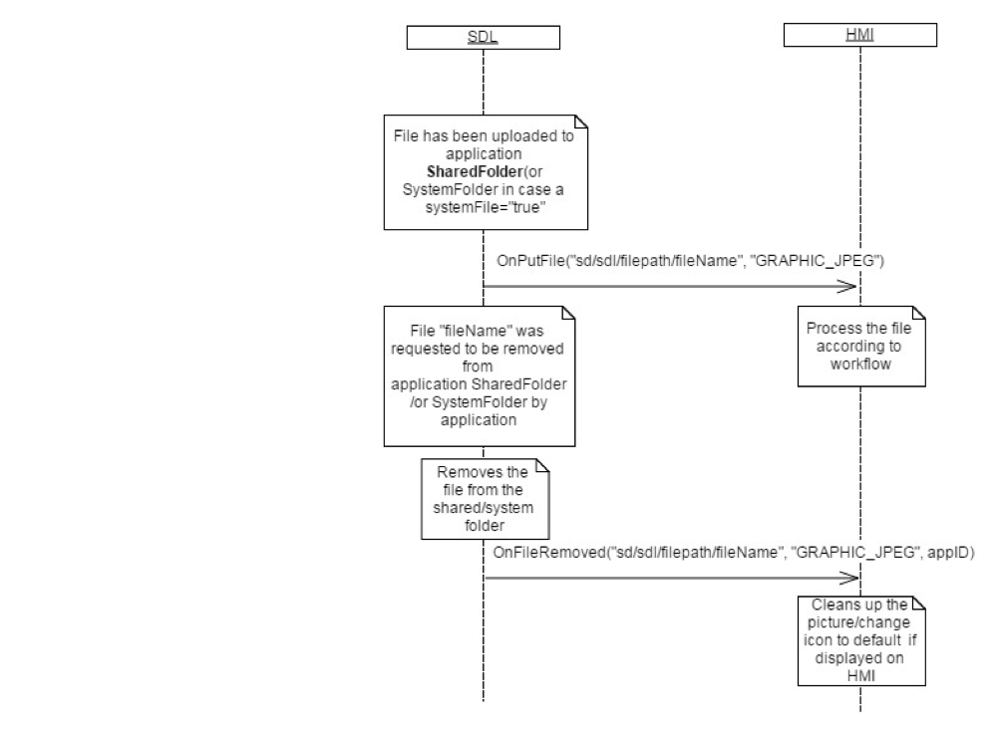

## OnFileRemoved

Type
: Notification

Sender
: SDL

Purpose
: Inform the HMI that a file has been removed from a shared folder by an application.

When a file is requested to be removed by an application, SDL will notify the HMI that the file has been removed.

!!! MAY

If the named file that was removed was an app icon, the HMI may want to reset the app icon it was displaying to a default app icon.

!!!

!!! NOTE

SDL notifies the HMI about removing files only if the files were located in the HMI's shared folder. 

!!!


### Notification

#### Parameters

|Name|Type|Mandatory|Additional|
|:---|:---|:--------|:---------|
|fileName|String|true|minlength: 1<br>maxlength: 30|
|fileType|[Common.FileType](../../common/enums/#filetype)|true||
|appID|Integer|true||

### Sequence Diagrams

|||
File Removed from Head Unit

|||

### JSON Message Examples

#### Example Notification

```json
{
	"jsonrpc": "2.0",
	"method": "BasicCommunication.OnFileRemoved",
	"params": {
		"appID": 31780,
		"fileName": "/fs/rwdata/storage/sdl/Emergency584421907/syncFileName",
		"fileType": "GRAPHIC_BMP"
	}
}
```
