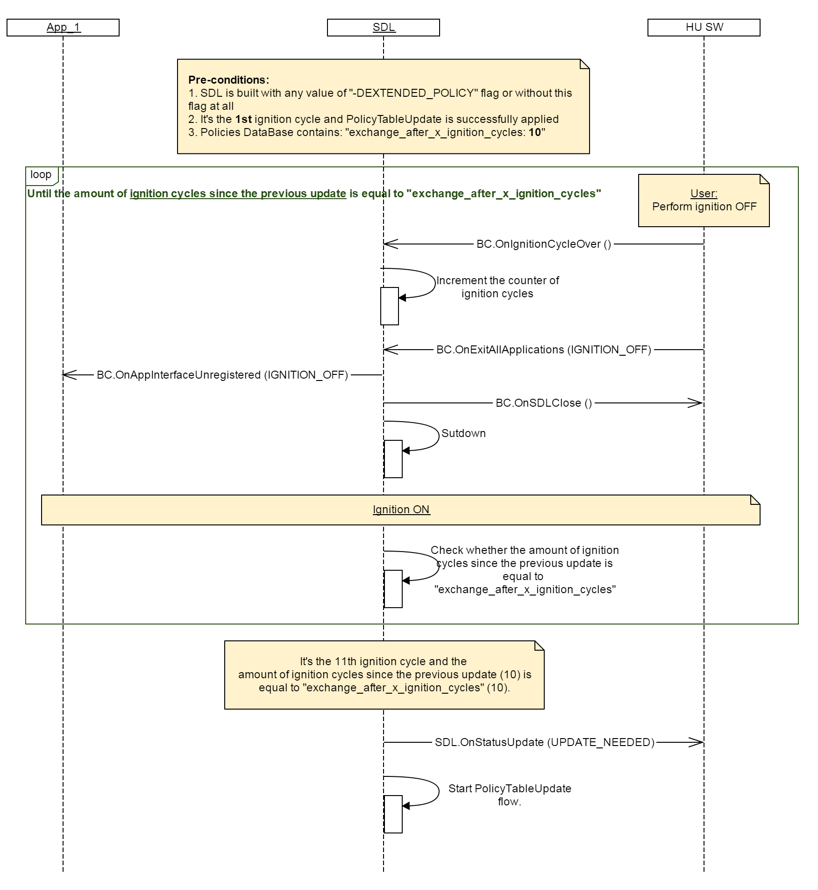

## OnIgnitionCycleOver

Type
: Notification

Sender
: HMI

Purpose
: Trigger SDL to increment the counter of ignition cycles in Local Policy Table

### Notification

!!! must

Send `BC.OnIgnitionCycleOver` together with `BC.OnExitAllApplications(IGNITION_OFF)` to SDL once ignition off is detected.

!!!

!!! note

1. `BC.OnIgnitionCycleOver` dependencies:
    * SDL expects `BC.OnIgnitionCycleOver` _only in case_ policies are enabled. _Otherwise_ SDL only needs `BC.OnExitAllApplications(IGNITION_OFF)`.
2. By getting `BC.OnIgnitionCycleOver` SDL increments the `"ignition_cycles_since_last_exchange"` counter in Local Policies Table  
3. Once the value of `"ignition_cycles_since_last_exchange"` gets equal to the value of `"exchange_after_x_ignition_cycles"`, SDL triggers a Policy Table Update

!!!

#### Parameters

This RPC has no additional parameter requirements

### Sequence Diagrams

|||
OnIgnitionCycleOver in triggering a Policy Table Update flow

|||

### JSON Message Examples

#### Example Notification

```json
{
	"jsonrpc" : "2.0",
	"method" : "BasicCommunication.OnIgnitionCycleOver"
}
```
