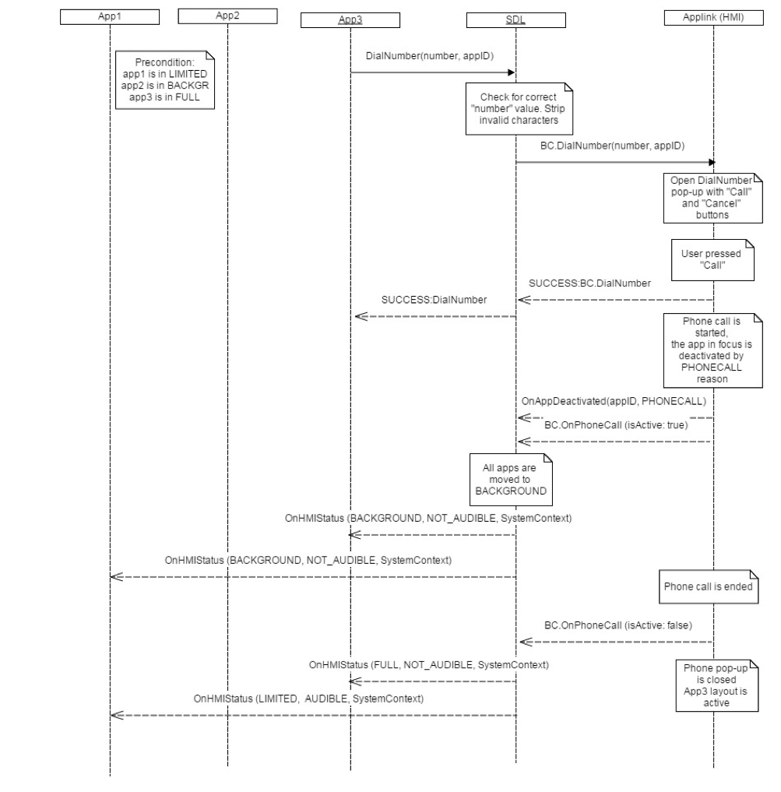

## OnPhoneCall

Type
: Notification

Sender
: HMI

Purpose
: Notify SDL that a Phone Call event has started or completed.


### Notification

#### Parameters

|Name|Type|Mandatory|Additional|
|:---|:---|:--------|:---------|
|isActive|Boolean|true||

### Sequence Diagrams
|||
Phone Call

|||

#### JSON Example Notification
```json
{
  "jsonrpc" : "2.0",
  "method" : "BasicCommunication.OnPhoneCall"
     "params" :
  {
       "isActive": true
     }
}
```
