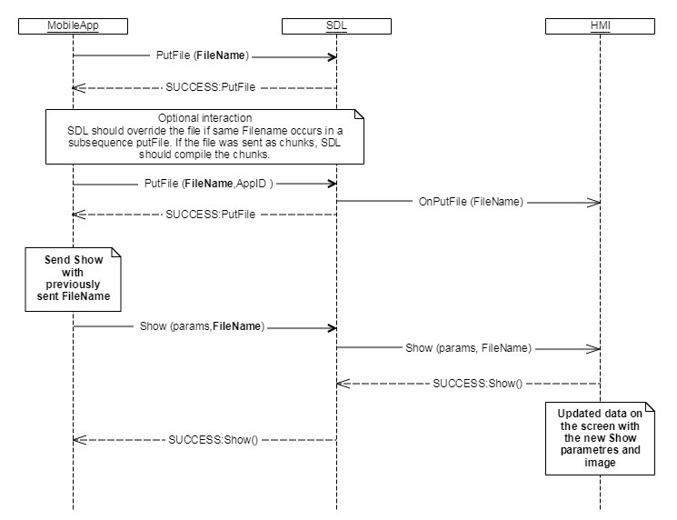

## OnPutFile

Type
: Notification

Sender
: SDL

Purpose
: Inform the HMI that a file has been uploaded into a shared folder by an application.

`OnPutFile` notifies the HMI that some file has been put into a shared or system folder that can be used by the HMI.

!!! MUST

1. If `isSystemFile` is set to true, use the appropriate uploaded file according to its workflow (IVSU, SystemRequest, RPC's). See diagrams listed below.  
2. Whenever HMI gets RPC with `Image` which has `.isTemplate` set to true, the HMI has to:

- load the proper image pattern
- extract alpha channel from the template image
- apply the alpha channel to the image pattern
- use this newly generated image instead of the uploaded one  

and whenever the UI changes, the HMI has to recreate images currently visible on the screen.
!!!

!!! NOTE

The list of RPCs and data structures that `OnPutFile` affects are:

  * Show (Image, SoftButton)
  * ShowConstantTBT (Image, SoftButton)
  * CreateInteractionChoiceSet (Image)
  * SetGlobalProperties (Image, VrHelpItem)
  * ResetGlobalProperties (Image, VrHelpItem)
  * UpdateTurnList (Turn, SoftButton)
  * AddCommand(Image)
  * SendLocation(Image)
  * Alert (SoftButton)  
  * AlertManeuver (SoftButton)
  * ScrollableMessage (SoftButton)

!!!

### Notification

#### Parameters

|Name|Type|Mandatory|Additional|
|:---|:---|:--------|:---------|
|offset|Integer|false|minvalue: 0<br>maxvalue: 100000000000|
|length|Integer|false|minvalue: 0<br>maxvalue: 100000000000|
|fileSize|Integer|false|minvalue: 0<br>maxvalue: 100000000000|
|syncFileName|String|true|maxlength: 255|
|fileType|[Common.FileType](../../common/enums/#filetype)|true||
|persistentFile|Boolean|false|defvalue: false|
|isSystemFile|Boolean|false||
|appID|Integer|false||

### Sequence Diagrams
|||
Put File used before referencing RPC

|||
|||
Put File used after referencing RPC

|||
|||
System Request file upload using Put File

|||

### JSON Example Notification
```json
{
  "jsonrpc" : "2.0",
  "method" : "BasicCommunication.OnPutFile",
  "params" : {
    "syncFileName":"/fs/sharedFolder/app1_device1/icon.jpg",
    "fileType":"GRAPHIC_JPEG"
  }
}
```
