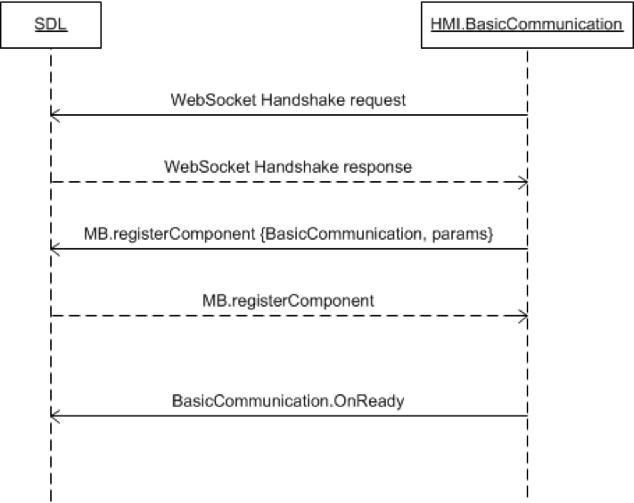

## OnReady
Type
: Notification

Sender
: HMI

Purpose
: Inform SDL about readiness to communicate

`OnReady` is the first message which begins the SDL-HMI communication after the WebSocket transports are established.

!!! must

In order to communicate with SDL, the HMI must send this notification after the connection is established and the HMI is ready for communication.

!!!

### Notification

#### Parameters

This RPC has no additional parameter requirements

### JSON Message Examples

#### Example Notification
```json
{
  "jsonrpc" : "2.0",
  "method" : "BasicCommunication.OnReady"
}
```

### Sequence Diagrams
|||
OnReady WebSocket

|||