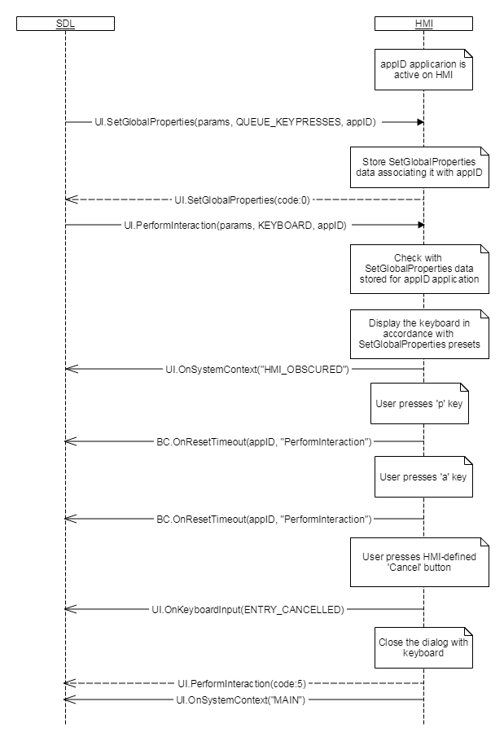
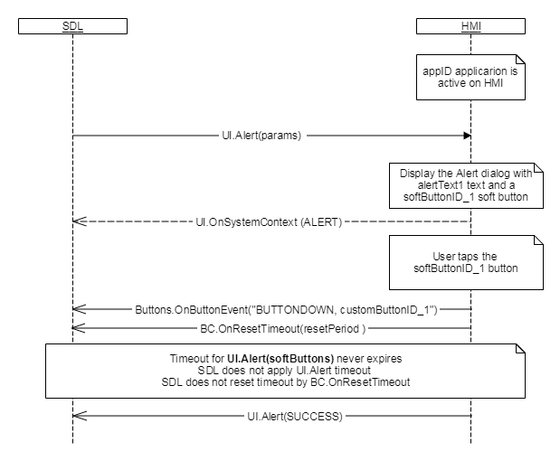

## OnResetTimeout

Type
: Notification

Sender
: HMI

Purpose
: Inform SDL that the timeout needs to be reset for an RPC instance

HMI can send this RPC to notify SDL that the timeout needs to be reset for an RPC request. `BC.OnResetTimeout` can be used for functions in all interfaces.

!!! must

  1. Send `BC.OnResetTimeout` to SDL in case HMI needs more time to process a request from a mobile application.
  2. Fine tune the wait time per method call as needed.
  3. Control the number of reset timeouts and duration of each reset timeout for endless or finite method timeout.

!!!

!!! note
Currently, there is no version negotiation between HMI and Core, so older HMI implementations will not work with Core 8.0 version.
!!!

### Notification

#### Parameters

|Name|Type|Mandatory|Additional|Description|
|:---|:---|:--------|:---------|:---------|
|requestID|Integer|true|minvalue: 0<br>maxvalue: 65535|Id between HMI and SDL which SDL used to send the request for method in question, for which timeout needs to be reset|
|methodName|String|true||Name of the function for which timeout needs to be reset|
|resetPeriod|Integer|false|minvalue: 0<br>maxvalue: 1000000|Timeout period in milliseconds, for the method for which timeout needs to be reset.<br>If omitted, timeout would be reset by defaultTimeout specified in smartDeviceLink.ini|

### Sequence Diagrams

|||
OnResetTimeout during PerformInteraction

|||

|||
OnResetTimeout during ScrollableMessage

|||

|||
OnResetTimeout KEEP_CONTEXT during alert

|||

### JSON Message Examples

#### Example Notification

```json
{
  "jsonrpc" : "2.0",
  "method" : "BasicCommunication.OnResetTimeout",
     "params" :
  {
    "requestID" : 123,
    "methodName" : "TTS.Speak",
    "resetPeriod" : 10000
  }
}
```
