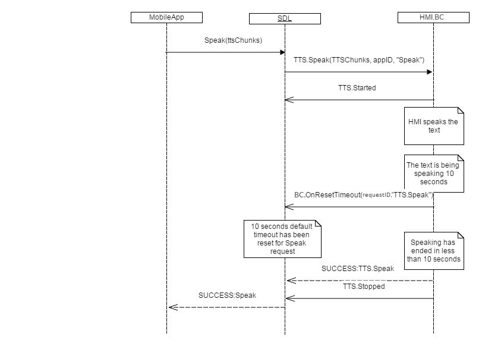
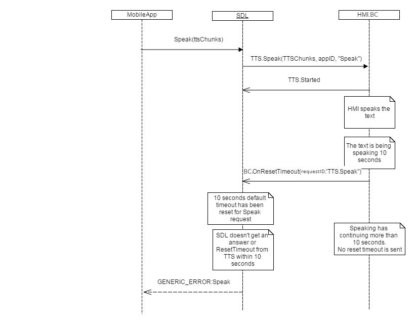

## OnResetTimeout

Type
: Notification

Sender
: HMI

Purpose
: Inform SDL about RPC instance for which timeout needs to be reset 

### Notification
HMI can send this notification across all the interfaces and for all the request RPCs to notify that timeout needs to be reset.

!!! must
  * send OnResetTimeout to SDL in case HMI needs more time for processing a request from mobile application
  * fine tune the wait time per method call as needed
  * control number of reset timeouts and duration of each reset timeout for endless or finite method timeout

Send OnResetTimeout notification in the following cases 
1. CreateInteractionChoiceSet/AddCommand
    1. Time taken to add VR grammar varies by underlying voice module and number of VR commands. We have seen the request getting timeout before the entire batch of VR commands can be processed.
2. SendLocation
    1. SendLocation popup remains on HMI to wait for user's selection. 
3. SetInteriorVehicleData
    1. Time for completion of a set action varies by target module. This can potentially be significantly more than SDL predefined timeout
4. GetInteriorVehicleDataConsent
    1. This is a user side HMI dialogue which needs input from user.
5. Alert
    1. This is a user side HMI dialogue which needs input from user.
6. Slider
    1. This is a user side HMI dialogue which needs input from user.
7. PerformInteraction
    1. This is a user side HMI dialogue which needs input from user.
8. ScrollableMessage
    1. This is a user side HMI dialogue which needs input from user.
9. DialNumber
    1. This is a user side HMI dialogue which needs input from user.
10. Any other request which can potentially take more time than predefined SDL timeout

!!!

_Note: Currently there is no version negotiation between HMI and Core, so older HMI implementations will not work with this new version of Core._

#### Parameters
|Name|Type|Mandatory|Additional|
|:---|:---|:--------|:---------|
|requestID|Integer|true|minvalue="0" maxvalue="65535"|
|methodName|String|true||
|resetPeriod|Integer|false| minvalue="0" maxvalue="1000000" |

### Sequence Diagrams
|||
OnResetTimeout for Speak SUCCESS

|||
|||
OnResetTimeout for Speak GENERIC_ERROR

|||

#### JSON Example Notification
```json
{
  "jsonrpc" : "2.0",
  "method" : "BC.OnResetTimeout",
     "params" :
  {
    "requestID" : 123,
    "methodName" : "TTS.Speak",
    "resetPeriod" : 10000
  }
}
```
