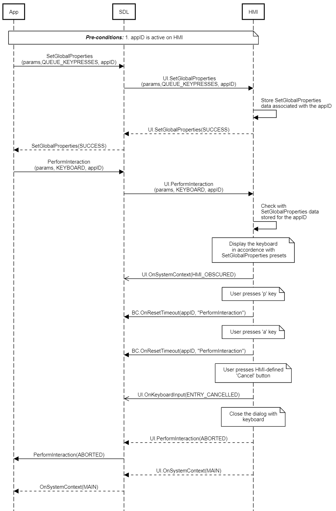
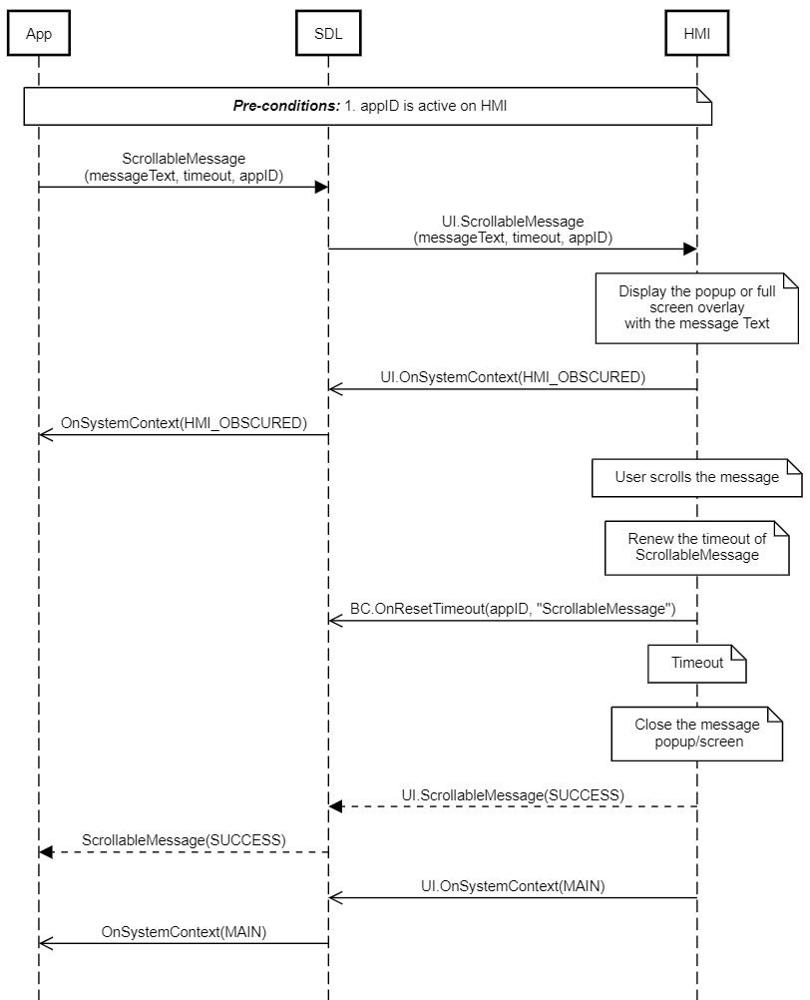
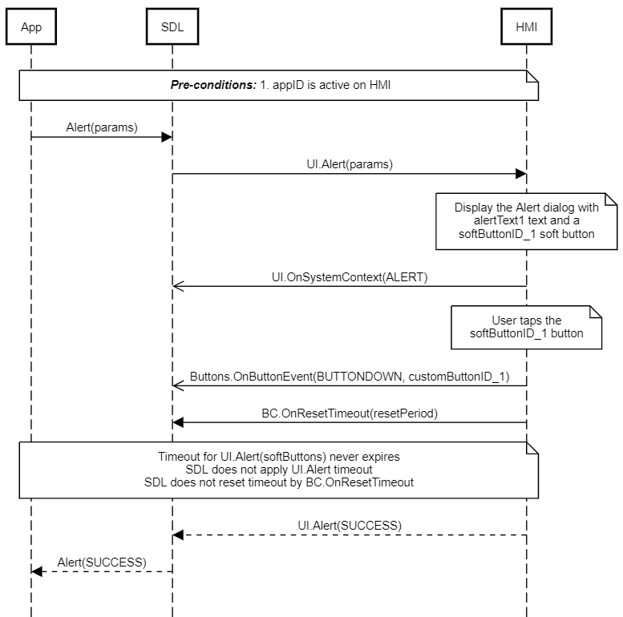

## OnResetTimeout

Type
: Notification

Sender
: HMI

Purpose
: Inform SDL about RPC instance for which timeout needs to be reset 

### Notification
HMI can send this notification used by functions in all interfaces to notify that timeout needs to be reset.

!!! must

  1. Send `BC.OnResetTimeout` to SDL in case HMI needs more time for processing a request from mobile application.
  2. Fine tune the wait time per method call as needed.
  3. Control number of reset timeouts and duration of each reset timeout for endless or finite method timeout.

!!!

_Note: Currently, there is no version negotiation between HMI and Core, so older HMI implementations will not work with Core_8.0 version._

#### Parameters
|Name|Type|Mandatory|Additional|Description|
|:---|:---|:--------|:---------|:---------|
|requestID|Integer|true||Id between HMI and SDL which SDL used to send the request for method in question, for which timeout needs to be reset|
|methodName|String|true||Name of the function for which timeout needs to be reset|
|resetPeriod|Integer|false| minvalue="0" maxvalue="1000000"|Timeout period in milliseconds, for the method for which timeout needs to be reset.<br>If omitted, timeout would be reset by defaultTimeout specified in smartDeviceLink.ini|

### Sequence Diagrams

|||
OnResetTimeout during PerformInteraction

|||

|||
OnResetTimeout during ScrollableMessage

|||

|||
OnResetTimeout KEEP_CONTEXT during alert

|||

#### JSON Example Notification
```json
{
  "jsonrpc" : "2.0",
  "method" : "BC.OnResetTimeout",
     "params" :
  {
    "requestID" : 123,
    "methodName" : "TTS.Speak",
    "resetPeriod" : 10000
  }
}
```
