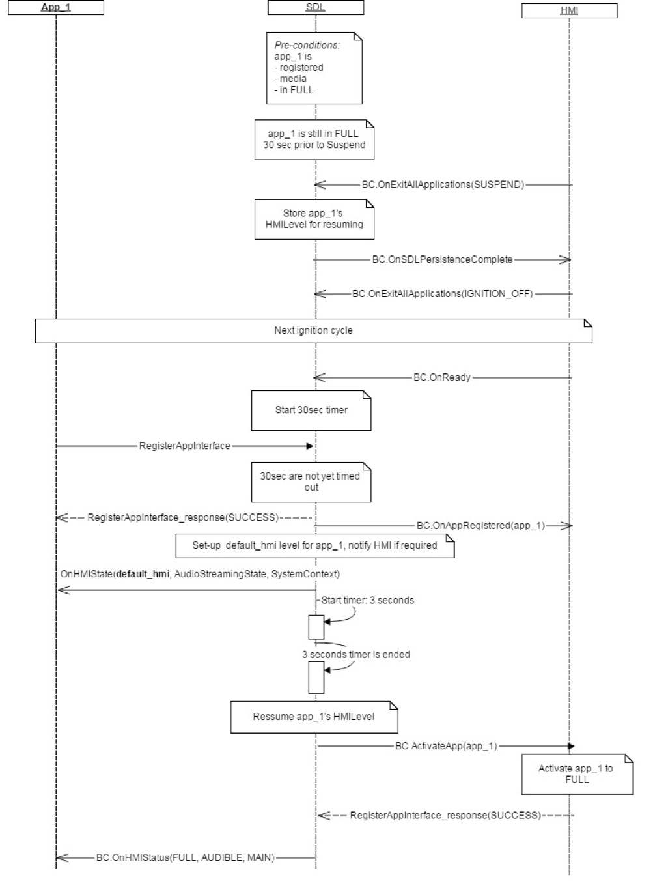
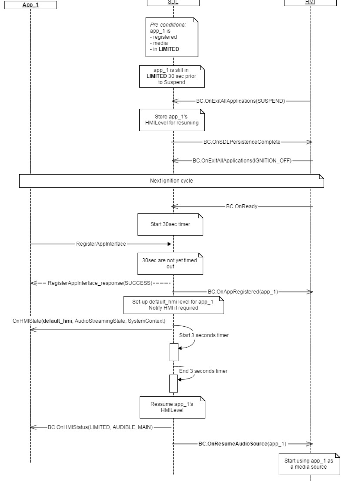
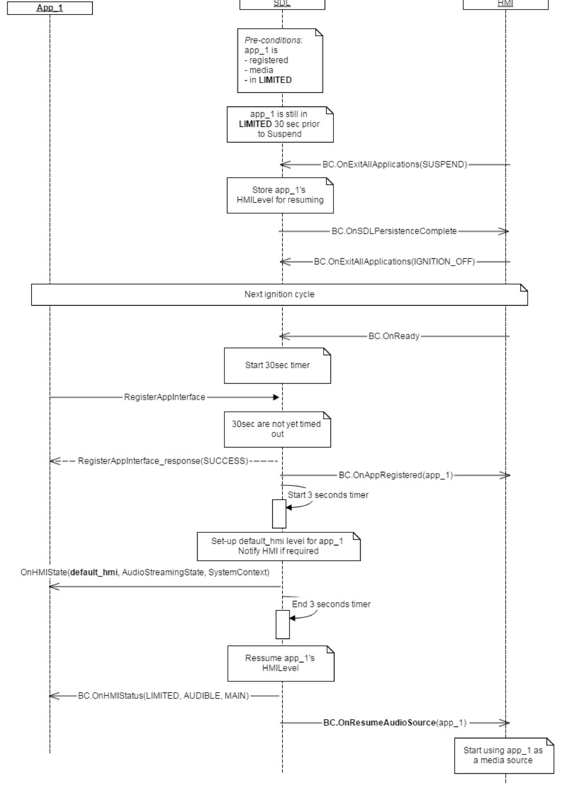
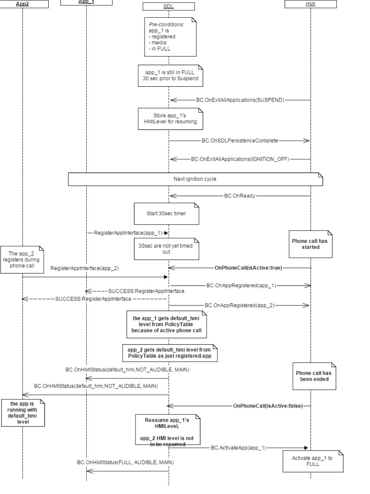

## OnResumeAudioSource

Type
: Notification

Sender
: SDL

Purpose
: Inform the HMI that an application being resumed needs to become audible.

SDL sends `OnResumeAudioSource` to the HMI when the resumption process sees that a currently registered application was `AUDIBLE` before the previous `Ignition Off`.

!!! NOTE

SDL will send `OnResumeAudioSource` if the application meets both of these conditions:

  1. Application was running 30 minutes prior to [OnExitAllApplications](../onexitallapplications)(`SUSPEND`).
  2. Application reconnects no later than 30 seconds after SDL receives an [OnReady](../onready) notification from the HMI.

!!!

!!! MUST

  1. Activate the audio source for the application corresponding to the `appID` that was received.
  2. Do not activate the application itself. The application must stay in the background of the UI.
    * If SDL means for the app to be resumed to the foreground of the UI, SDL would send an [ActivateApp](../activateapp) notification instead (See diagrams below).

!!!


### Notification

#### Parameters

|Name|Type|Mandatory|Additional|
|:---|:---|:--------|:---------|
|appID|Integer|true||

### Sequence Diagrams
|||
Audio Source Resumption for App in FULL

|||
|||
Audio Source Resumption for App in LIMITED

|||
|||
Audio Source Resumption after Phone Call

|||
|||
Audio Source Resume one audio app one phone call app

|||

### Example Notification
```json
{
  "jsonrpc" : "2.0",
  "method" : "BasicCommunication.OnResumeAudioSource",
  "params" :{
    "appID" : 123
  }
}
```
