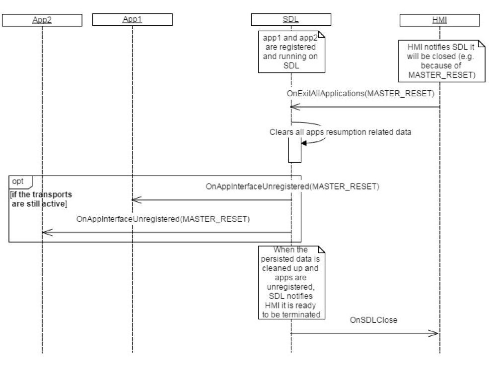

## OnSDLClose

Type
: Notification

Sender
: SDL

Purpose
: Inform the HMI that SDL is ready to be terminated by the system.

`OnSDLClose` notification is sent by SDL to notify the HMI that SDL has terminated all activity, saved/cleaned up necessary data, unregistered all applications, and the SDL Core process is ready to be closed by the system.

!!! MUST

  1. Notify SDL about an intention to terminate because of `Ignition Off`, `Master Reset`, or `Factory Reset` via [OnExitAllApplications](../onexitallapplications).
  2. Terminate the SDL process only after receiving `OnSDLClose`. Otherwise, application data may be lost.

!!!

!!! NOTE

SDL unregisters applications if the transports are still availble after an `Ignition Off`.

SDL cleans up applications' persistent data if the HMI calls for a `Factory Reset` or `Master Reset` via [OnExitAllApplications](../onexitallapplications).

!!!

### Notification

#### Parameters

This RPC has no additional parameter requirements

### Sequence Diagrams
|||
OnSDLClose Ingition Cycle

|||
|||
OnSDLClose Master Reset

|||

### Example Notification
```json
{
  "jsonrpc" : "2.0",
  "method" : "BasicCommunication.OnSDLClose"
}
```
