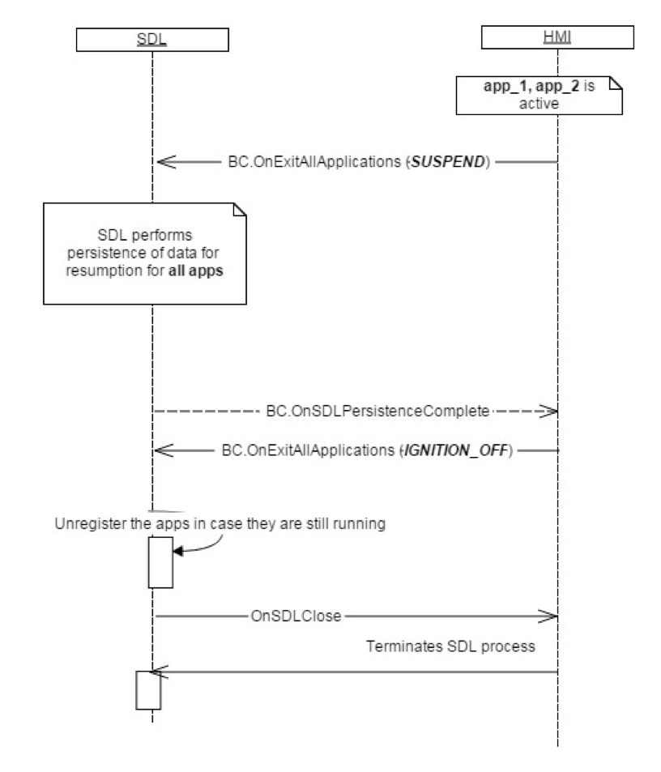

## OnSDLPersistenceComplete

Type
: Notification

Sender
: SDL

Purpose
: Inform HMI that any data persistence operations have been completed.

SDL sends `OnSDLPersistenceComplete` when all data persistence operations are complete. The data made persistent is used for future resumption scenarios.

!!! MUST

  1. Send [OnExitAllApplications](../onexitallapplications)(`SUSPEND`) to initiate the data persistence process for registered apps.
  2. Wait for `OnSDLPersistenceComplete` before sending [OnExitAllApplications](../onexitallapplications)(`IGNITION_OFF`).

!!!

### Notification

#### Parameters

This RPC has no additional parameter requirements

### Sequence Diagrams
|||
SDL Persists App Data after Suspend before Ignition Off

|||

### Example Notification
```json
{
  "jsonrpc" : "2.0",
  "method" : "BasicCommunication.OnSDLPersistenceComplete"
}
```
