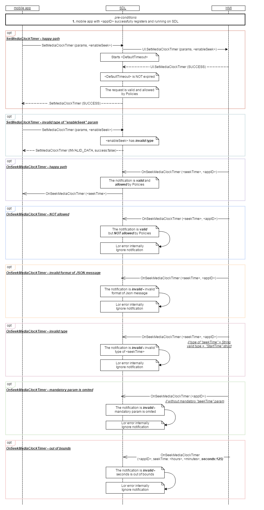

## OnSeekMediaClockTimer
  * Type: notification
  * Sender: HMI
  * Purpose: Callback for the seek media clock timer notification.
  
  
  ### Behavior
 A notification will be provided if the user touches (or seeks) to a particular position on the HMI mediaclock timer. 
 The notification will contain a starttime with the position the user has seeked to.
   
  !!! NOTE   
_**SDL must**_:   

1) if HMI sends to SDL _OnSeekMediaClockTimer_ **valid** and **NOT allowed** by Local Policy Table notification:   
     - log corresponding error internally;   
     - ignore this _OnSeekMediaClockTimer_ notification;   
   _**SDL must NOT**_: transfer _OnSeekMediaClockTimer_ notification from HMI to mobile application.   
   
2) if HMI sends to SDL _OnSeekMediaClockTimer_ **valid** and **allowed** by Local Policy Table notification:   
     - transfer _OnSeekMediaClockTimer_ notification from HMI to mobile application.   
3) transfer _OnSeekMediaClockTimer_ notification from HMI to mobile app **independently** on value of "enableSeek"
(true or false) parameter at _SetMediaClockTimer_request_.
!!!

### Request

#### Parameters

|Name|Type|Mandatory|Additional|
|:---|:---|:--------|:---------|
|seekTime|[Commom.TimeFormat]|true|see [StartTime]|
|appID|Integer|true|The ID of application that relates to this mediaclock position change.|

[Commom.TimeFormat]: ../../common/structs/#timeformat
[StartTime]: ../../ui/setmediaclocktimer/#parameters

### Response

#### Parameters

This RPC has no additional parameter requirements.

### Sequence Diagrams

|||

|||

### Example Request
```
{
            "params": {
                        "seekTime": {
                                   "minutes": 1,
                                   "seconds": 33,
                                   "hours": 0
                        },
                        "appID": 753022517
            },
            "method": "UI.OnSeekMediaClockTimer",
            "jsonrpc": "2.0"
}
```

### Example Response
```
{
            seekTime={
                        hours=0,
                        minutes=1,
                        seconds=33
            }
}
```


