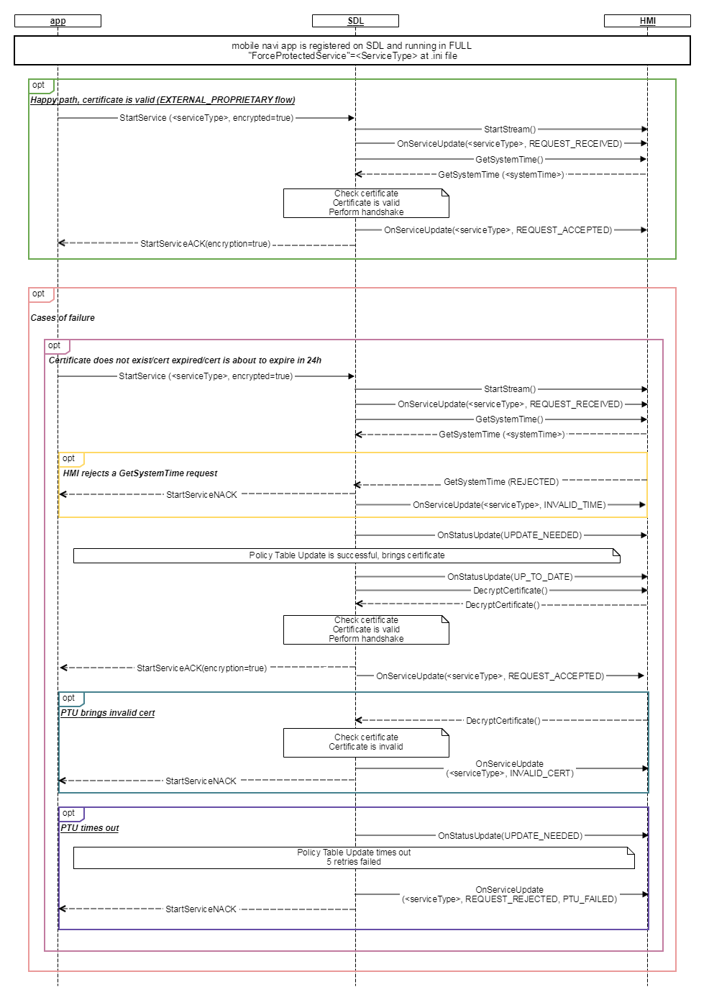

## OnServiceUpdate

Type
: Notification

Sender
: SDL

Purpose
: Update HMI with the status of a particular service

!!! may

Display a pop-up providing accurate feedback to the user on the status of the system or what steps to take in case of an error.

!!!

### Notification
When a mobile navigation application is activated and sends a request for the Video Service there is a series of steps taken. 
These steps include:

* getting the current [system time](../GetSystemTime/index.md) 
* performing a policy table update  
* decrypting certificates and ensuring validity of the certificates  

Processing these steps SDL sends OnServiceUpdate notification to HMI to provide accurate feedback on the status of the system.  

#### Parameters

|Name|Type|Mandatory|Additional|
|:---|:---|:--------|:---------|
|serviceType|[Common.ServiceType](../../common/enums/#servicetype)|true||
|serviceEvent|[Common.ServiceEvent](../../common/enums/#serviceevent)|false||
|reason|[Common.ServiceUpdateReason](../../enums/#serviceupdatereason)|false||
|appID|Integer|false||

_Note:_ the only time when SDL would not be able provide the `appID` would be during the first StartService request for the RPC service before RAI was sent.

### Sequence Diagrams

|||
OnServiceUpdate

|||

#### JSON Example Notification

```json
{
    "jsonrpc": "2.0",
    "method": "BC. OnServiceUpdate",
    "params": {
        "serviceType": "RPC",
        "serviceEvent":"REQUEST_RECEIVED"
              }
}
```
