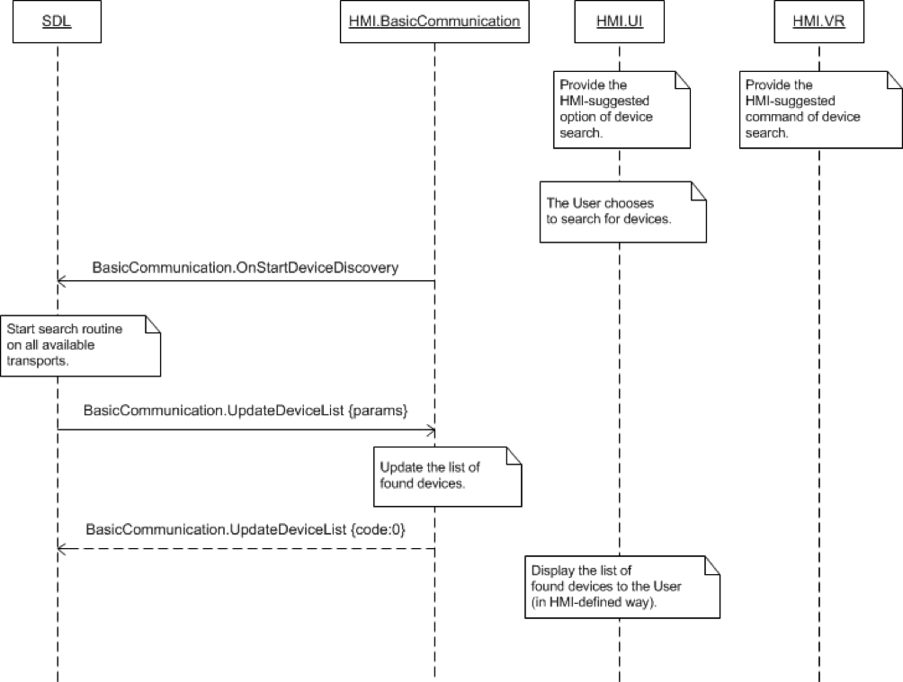

## OnStartDeviceDiscovery

  * Type: Notification
  * Sender: HMI
  * Purpose: Initiate device search

On receipt of this notification SDL starts searching for devices on all available transports. Afterwards, SDL provides the search results via [UpdateDeviceList](../UpdateDeviceList).

!!! note

This RPC tells SDL to initiate a new device search. The [OnUpdateDeviceList](../OnUpdateDeviceList) RPC asks SDL for the results of the most recent device query.

!!!

### Example Notification
```json
{
	"jsonrpc" : "2.0",
	"method" : "BasicCommunication.OnStartDeviceDiscovery"
}
```

### Sequence Diagrams
|||
Starting Device Discovery

|||

#### JSON Example Notification
```json

```
