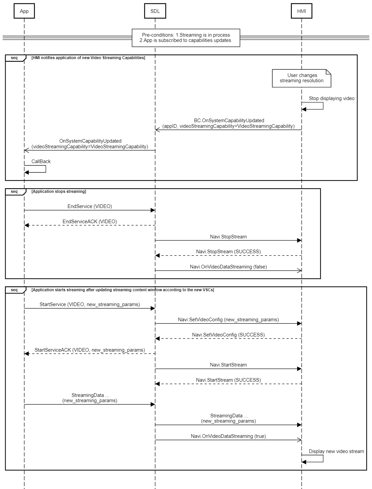

## OnSystemCapabilityUpdated

Type
: Notification

Sender
: SDL or HMI

Purpose
: Inform that a specific system capability has changed

### Notification

1. HMI sends OnSystemCapabilityUpdated notification to SDL after creating a widget _(see also [CreateWindow](../../UI/CreateWindow/index.md))_.
2. HMI sends OnSystemCapabilityUpdated notification after receiving UI.Show(templateConfiguration) request manipulating the content presented of main window or widgets.
3. HMI should not send `WEB_VIEW` template in `WindowCapability` for any widgets, and applications with `AppHMIType` other than `WEB_VIEW`.
4. If the application changes template to `WEB_VIEW`, HMI should send OnSystemCapabilityUpdated with the following `textFields` restrictions in `WindowCapability`:
    * `menuName` and `templateTitle` should be included, if they are visible on HMI.
    * `mainField1-4`, `statusBar` and `mediaTrack` should not be included if OEM implemented the `WEB_VIEW` template without these text fields.
    * `availabletemplates`, `buttonCapabilities` and `imageTypeSupported` should reflect the general capabilities of the window/system.
5. HMI sends OnSystemCapabilityUpdated(VIDEO_STREAMING) notification to notify a subscribed mobile application that video streaming resolution has switched.

!!! NOTE

Template `WEB_VIEW` is only allowed for the WebEngine applications with `AppHMIType`=`WEB_VIEW`.

!!!

#### Recommendations for how various screen modes have to be handled

If the change is a Picture-in-Picture-type change, scale the current video stream to the size you desire without going through this flow. Touches should never be passed to the app. Either a system menu/buttons should be displayed when selected, or the selection should bring the user immediately back to the full-screen app.

If the change is a split-screen type change (and cannot be handled by scaling the original video), then go through this flow. If the app does not support your custom split-resolution, either don't allow the user to put the app in split screen, or scale the video stream to a size that fits the window and use "black bars" to fill the rest of the window. Touches may be passed to the app in certain limited cases.

 * The window must have a width of at least 3" and a height of at least 3".

 * The touches must be offset for the developer so that 0,0 continues to be in the top-left corner of the app window. If these requirements are not met, either a system menu / buttons should be displayed when selected, or the selection should bring the user immediately back to the full-screen app.

#### Parameters

|Name|Type|Mandatory|Additional|
|:---|:---|:--------|:---------|
|systemCapability|[Common.SystemCapability](../../common/structs/#systemcapability)|true||
|appID|Integer|false||

### Sequence Diagrams

|||
OnSystemCapabilityUpdated(APP_SERVICES, PUBLISHED)

|||

|||
OnSystemCapabilityUpdated(APP_SERVICES, REMOVED)

|||

|||
OnSystemCapabilityUpdated(VIDEO_STREAMING) Streaming Resolution Switching

|||

### JSON Message Examples

#### Example Notification

```json
{
  "jsonrpc": "2.0",
  "method": "BasicCommunication.OnSystemCapabilityUpdated",
  "params": {
    "systemCapability": {
      "appServicesCapabilities": {
        "appServices": [
          {
            "updatedAppServiceRecord": {
              "serviceActive": true,
              "serviceID": "c9503a4f983e3dd31a7a14564d405cdf84769c9b9a71cae9cc211a0b74e93629",
              "serviceManifest": {
                "allowAppConsumers": true,
                "rpcSpecVersion": {
                  "majorVersion": 5,
                  "minorVersion": 1,
                  "patchVersion": 0
                },
                "serviceName": "Mobile Media Service",
                "serviceType": "MEDIA"
              },
              "servicePublished": true
            }
          },
          {
            "updateReason": "PUBLISHED",
            "updatedAppServiceRecord": {
              "serviceActive": false,
              "serviceID": "d6d8d2fb2bfcc00033804fb19e9fb7d6070d2c166f49881563276f17478c39f8",
              "serviceManifest": {
                "allowAppConsumers": true,
                "rpcSpecVersion": {
                  "majorVersion": 5,
                  "minorVersion": 1,
                  "patchVersion": 0
                },
                "serviceName": "Waze Music",
                "serviceType": "MEDIA"
              },
              "servicePublished": true
            }
          }
        ]
      },
      "systemCapabilityType": "APP_SERVICES"
    }
  }
}
```

#### Videosteaming Switching Example Notification

```json
{
   "jsonrpc":"2.0",
   "method":"BasicCommunication.OnSystemCapabilityUpdated",
   "params":{
      "appID":489377304,
      "systemCapability":{
         "systemCapabilityType":"VIDEO_STREAMING",
         "videoStreamingCapability":{
            "preferredResolution":{
               "resolutionWidth":800,
               "resolutionHeight":380
            },
            "maxBitrate":20000,
            "scale":1
         }
      }
   }
}
```
