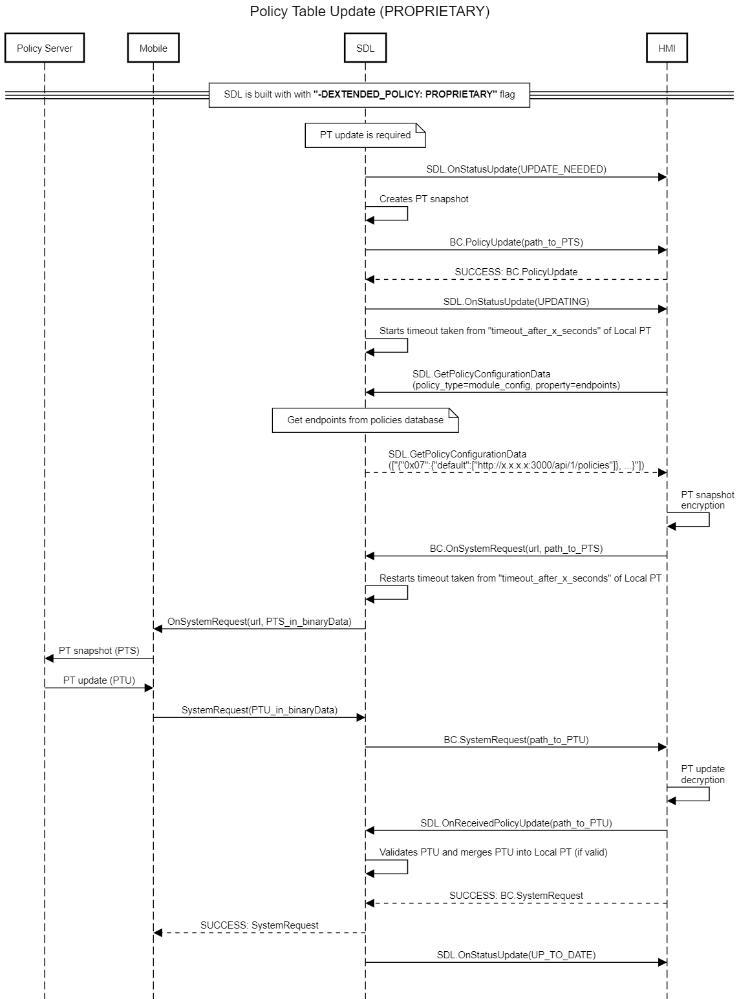

## OnSystemRequest

Type
: Notification

Sender
: SDL

Purpose
: A request from SDL to download data via a connected application.

**HTTP flow**

* SDL sends the PTS snapshot as binary data via an `OnSystemRequest` mobile request from the system to the backend. Both the "url" that the PTS will be forwarded to and the "timeout" must be taken from the Local Policy Table.
    * If no "url" is provided in the Local Policy Table, it is supposed that the mobile application will send the Policy Table Update data back to SDL.

### Notification

#### Parameters

|Name|Type|Mandatory|Additional|
|:---|:---|:--------|:---------|
|requestType|[Common.RequestType](../../common/enums/#requesttype)|true||
|url|String|false|minlength: 1<br>maxlength: 1000|
|fileType|[Common.FileType](../../common/enums/#filetype)|false||
|offset|Integer|false|minvalue: 0<br>maxvalue: 100000000000|
|length|Integer|false|minvalue: 0<br>maxvalue: 100000000000|
|timeout|Integer|false|minvalue: 0<br>maxvalue: 2000000000|
|fileName|String|true|minlength: 1<br>maxlength: 255|
|appID|String|false|minlength: 1<br>maxlength: 50|

### Sequence Diagrams
|||
System Requests File Download

|||

|||
BC.OnSystemRequest in "Proprietary" Policy Table Update Flow

|||

#### JSON Example Notification
```json
{
  "jsonrpc" : "2.0",
  "method" : "BasicCommunication.OnSystemRequest",
  "params" :
  {
    "fileName":"/fs/images/ivsu_cache/EncodedPolicyTable.json",
     "fileType":"JSON",
     "length":0,
     "offset":0,
     "requestType":"PROPRIETARY",
     "timeout":1000,
     "url":"https://policies.smartdevicelink.org/api/1/policies"
    }
}
```
