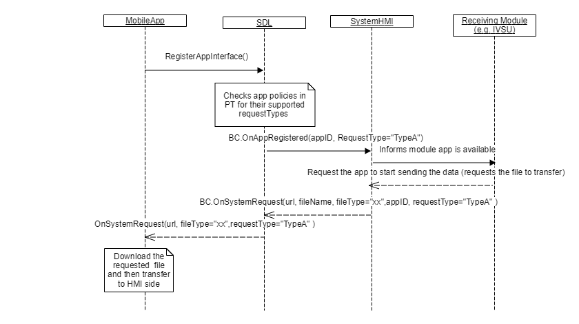

## OnSystemRequest

Type
: Notification

Sender
: SDL

Purpose
: A request from SDL to download data via a connected application.

**HTTP flow**

* SDL sends the PTS snapshot as binary data via an `OnSystemRequest` mobile request from the system to the backend. Both the "url" that the PTS will be forwarded to and the "timeout" must be taken from the Local Policy Table.
    * If no "url" is provided in the Local Policy Table, it is supposed that the mobile application will send the Policy Table Update data back to SDL.

`RequestType` defines the type of the requested data from a mobile device or the cloud. The HMI may request this data, but it's SDL's responsibility to block a `SystemRequest` in case the request intends to transfer a data type not allowed by the policy table.  
`requestSubType` is filled for supporting OEM proprietary data exchanges.

The HMI is informed about `requestTypes`, `requestSubType` that are allowed by policies via [OnAppPermissionChanged](../../sdl/onapppermissionchanged) and [OnAppRegistered](../onappregistered).

!!! NOTE

If the HMI sends `OnSystemRequest` with a request type disallowed by the policy table, SDL will ignore it.  
In case PT contains some value for `requestSubType` param and the HMI sends `OnSystemRequest` with `requestSubType=<not_in_PT>`, SDL does not forward this notification to mobile app. 

!!!

_**SyncP NOTE**_   
 1. It's SyncP responsibility to encrypt and encode PTS file and provide it to SDL via OnSystemRequest HMI API ("filename") parameter.      
 2. It's SyncP responsibility to choose an application for sending PTU and start timer (for future retry strategy) after sending OnSystemRequest to SDL.

!!! MUST   
1. Send `OnSystemRequest`, if specific data is requested from the mobile device/cloud, or binary data needs to be sent to the mobile device.
2. Send `OnSystemRequest` with `requestType=OEM_SPECIFIC` and `requestSubType=VEHICLE_DATA_MAPPING` to SDL to get OEM Network Mapping table.
3. NOT send `OnSystemRequest` to SDL while delivering PTS to the policy server using the in-vehicle modem.
4. Send `OnSystemRequest` to SDL (to forward it to mob app) in case HMI can't successfully retrieve PTU from the policy server using the in-vehicle modem.

!!!

### Notification

#### Parameters

|Name|Type|Mandatory|Additional|
|:---|:---|:--------|:---------|
|requestType|[Common.RequestType](../../common/enums/#requesttype)|true||  
|requestSubType|String|false|maxlength: 255|
|url|String|false|minlength: 1<br>maxlength: 1000|
|fileType|[Common.FileType](../../common/enums/#filetype)|false||
|offset|Integer|false|minvalue: 0<br>maxvalue: 100000000000|
|length|Integer|false|minvalue: 0<br>maxvalue: 100000000000|
|timeout|Integer|false|minvalue: 0<br>maxvalue: 2000000000|
|fileName|String|true|minlength: 1<br>maxlength: 255|
|appID|Integer|false||

### Sequence Diagrams
|||
System Requests File Download

|||

|||
BC.OnSystemRequest in "Proprietary" Policy Table Update Flow

|||

|||
BC.OnSystemRequest in Policy Table Update Flow with in-vehicle modem

|||

### JSON Message Examples

#### Example Notification
```json
{
  "jsonrpc" : "2.0",
  "method" : "BasicCommunication.OnSystemRequest",
  "params" :
  {
    "fileName":"/fs/images/ivsu_cache/EncodedPolicyTable.json",
     "fileType":"JSON",
     "length":0,
     "offset":0,
     "requestType":"PROPRIETARY",
     "timeout":1000,
     "url":"https://policies.smartdevicelink.org/api/1/policies"
    }
}
```
