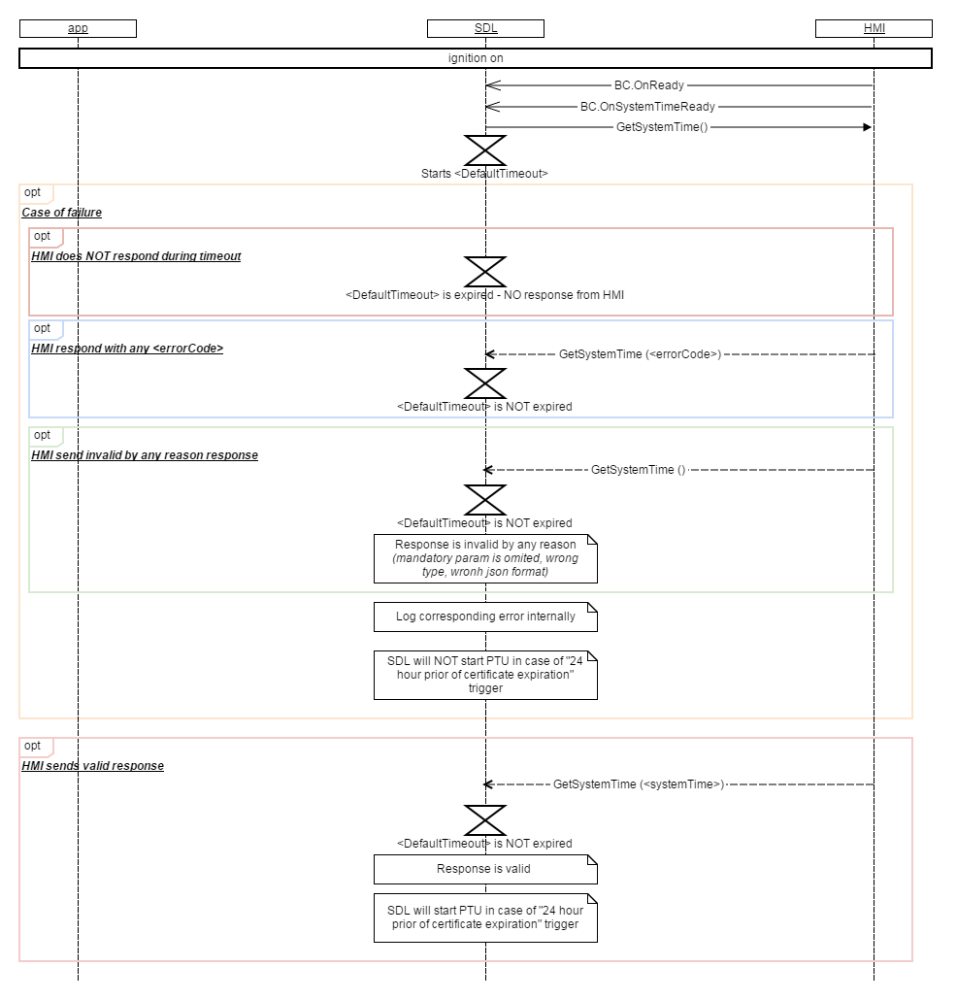

## OnSystemTimeReady

Type
: Notification

Sender
: HMI

Purpose
: Notifies SDL that the HMI is ready to provide accurate system time

!!! must

The HMI must send a BC.OnSystemTimeReady notification to SDL when a new ignition cycle occurs in order to notify SDL that the HMI is once again ready to provide accurate system time.

!!!

### Notification

#### Parameters

This RPC has no additional parameter requirements.

### Sequence Diagrams
|||
OnSystemTimeReady

|||

#### JSON Example Notification  

```
{
	"jsonrpc" : "2.0",
	"method" : "BasicCommunication.OnSystemTimeReady"
}
```
