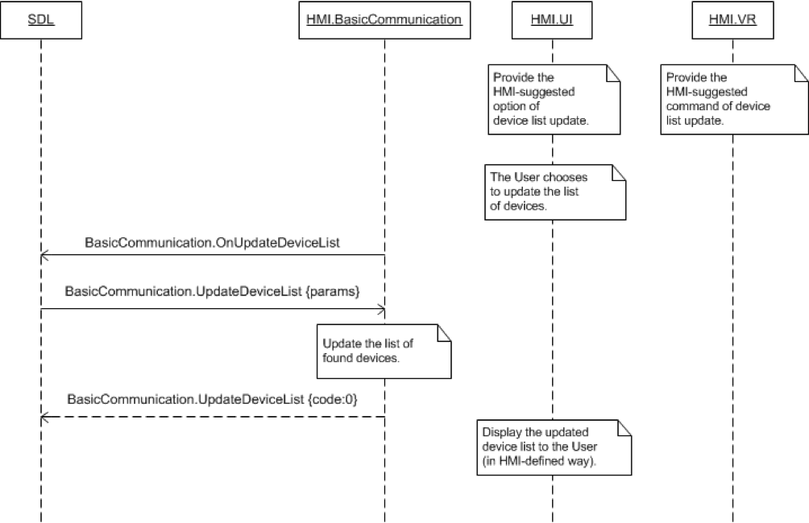

## OnUpdateDeviceList

Type
: Notification

Sender
: HMI

Purpose
: Ask for the updated list of connected devices.

Sending an `OnUpdateDeviceList` notification to SDL asks SDL to send back a list of discovered devices via [UpdateDeviceList](../updatedevicelist).

!!! MAY

  1. Provide the user with the possibility to request for an updated list of discovered devices.
  2. Send `OnUpdateDeviceList` when the user has chosen to update the device list.

!!! NOTE

`OnUpdateDeviceList` is similar and can be confused with `OnStartDeviceDiscovery`. The difference is that `OnUpdateDeviceList` asks SDL to return an updated list of discovered devices, and `OnStartDeviceDiscovery` asks SDL to initiate a search procedure to discover new devices.

!!!

### Notification

#### Parameters

This RPC has no additional parameter requirements

### Sequence Diagrams
|||
User Requests Device List Update

|||

#### JSON Example Notification
```json
{
  "jsonrpc" : "2.0",
  "method" : "BasicCommunication.OnUpdateDeviceList"
}
```
