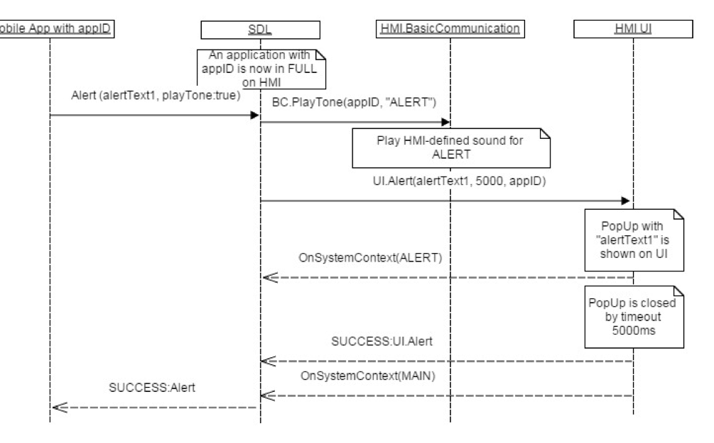

## PlayTone

Type
: Notification

Sender
: SDL

Purpose
: Tell the HMI to play a notification sound.

This notification may follow some SDL request that brings changes to the HMI (e.g. alert message displayed, audio capturing started, etc).

!!! MUST

Play the HMI's appropriate notification sound for the corresponding type of request defined in the `methodName` parameter. 

!!!
### Notification

#### Parameters

|Name|Type|Mandatory|Additional|
|:---|:---|:--------|:---------|
|appID|Integer|true||
|methodName|[Common.MethodName](../../Common/Enums/index.md#methodname)|true||

#### MethodName

|Name|Value|
|:---|:----|
|ALERT|0|
|SPEAK|1|
|AUDIO_PASS_THRU|2|
|ALERT_MANEUVER|3|

### Sequence Diagrams
|||
Play Tone with Alert

|||

### Example Request

```json
{
  "jsonrpc" : "2.0",
  "method" : "BasicCommunication.PlayTone",
"params" :
  {
    "appID" : 123,
      "methodName": "ALERT"
  }

}
```
### Example Response

```json
{
  "id" : 47,
  "jsonrpc" : "2.0",
  "result" :
  {
    "code" : 0,
    "method" : "BasicCommunication. PlayTone"
  }
}
```

### Example Error

```json
{
  "id" : 47,
  "jsonrpc" : "2.0",
  "error" :
  {
    "code" : 22,
    "message" : " Unknown system error",
    "method" : "BasicCommunication.PlayTone"
  }
}
```
