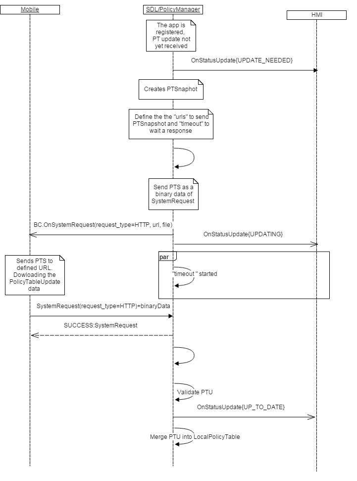

## PolicyUpdate
Type
: Function

Sender
: SDL

Purpose
: Inform HMI about the Policy Table Update (PTU) mechanism is triggered on SDL

In case SDL is built with **DEXTENDED_POLICY: HTTP" flag** SDL supports PolicyTableUpdate flow **without HMI-related logic**. 

### Request

``BC.PolicyUpdate`` represents SDL-generated request to start the PTU sequence.

**SDL must**

* Send SDL.OnStatusUpdate(UPDATE_NEEDED) to HMI.
* Copy PT Snapshot from the Local Policy Table, store PT snapshot in SDL memory and remove "messages" sub-section from "consumer_friendly_messages" section.
* Send PT Snapshot to a random app as binary data.
*  Define the URL(s) the PTS will be sent to. Policies Manager must refer PTS "endpoints" section, key "0x07" for the appropriate `<app id>` which was chosen for PTS transferring.
* SDL defines the timeout to wait a response on PTU as a value of PTS "module_config" section, key `<timeout_after_x_seconds>`.
* Send PTU status notifications on ``SDL.OnStatusUpdate`` to HMI.

_Note_

1. ``BC.PolicyUpdate`` dependencies:
   * SDL sends ``BC.PolicyUpdate`` 
2. Triggers for sending ``BC.PolicyUpdate`` (whichever comes first):
   * Days since previous successful PTU (``"exchange_after_x_days"`` value in local PolicyTable (PT))
   * Kilometers since previous successful PTU (``"exchange_after_x_kilometers"`` value in local PT)
   * Ignition cycles since previous successful PTU (``"exchange_after_x_ignition_cycles"`` value in local PT)
   * Expired module's certificate (stored in ``"certificate"``field of local PT). The current date is 24 hours prior to module's certificate expiration date:  
   a. The triggers for checking the cert expiration status are:  
   ignition on  
   TLS handshake  
   b. in case module's certificate in policies is expired or invalid, the TLS handshake will fail.
   * New application (that is, not-yet existing in local PT) registration
   * PoliciesManager must check the stored status of PTUpdate upon every Ign_On and in case the status is **UPDATE_NEEDED** PoliciesManager must initiate the PTUpdate sequence right after the first app registers on SDL
3. Parameters values origin:
   * ``file`` - is the path to the Snapshot of local PolicyTable (Snapshot PT final destination is Policies Server)
   * ``timeout`` - value taken from ``"timeout_after_x_seconds"`` field of local PT
   * ``retry`` - array of values from ``"seconds_between_retries"`` field of local PT. SDL handles the PTU retry sequence (re-requesting update if fails to receive during timeout) by itself.

#### Parameters

|Name|Type|Mandatory|Additional|
|:---|:---|:--------|:---------|
|file|String|true|minlength: 1<br>maxlength: 255|
|timeout|Integer|true|minvalue: 0<br>maxvalue: 65535|
|retry|Integer|true|array: true<br>minsize: 1<br>maxsize: 5<br>minvalue: 0<br>maxvalue: 65535|


#### Parameters

This RPC has no additional parameter requirements

### Example Request

```json
{
	"id": 103,
	"jsonrpc": "2.0",
	"method": "BasicCommunication.PolicyUpdate",
	"params":
	{
		"file": " / tmp / fs / mp / SnapshotPT.json ",
		"timeout": 60,
		"retry": [1, 5, 25, 125, 625]
	}
}

```
### Example Response

```json
{
	"id": 103,
	"jsonrpc": "2.0",
	"result":
	{
		"code": 0,
		"method": "BasicCommunication.PolicyUpdate"
	}
}

```

### Example Error

```json
{
	"id": 103,
	"jsonrpc": "2.0",
	"error": {
		"code": 11,
		"message": "Snapshot PT file not found",
		"data":
		{
			"method": "BasicCommunication.PolicyUpdate"
		}
	}
}

```

### Sequence Diagrams

|||
BC.PolicyUpdate in "HTTP" Policy Table Update Flow

|||
