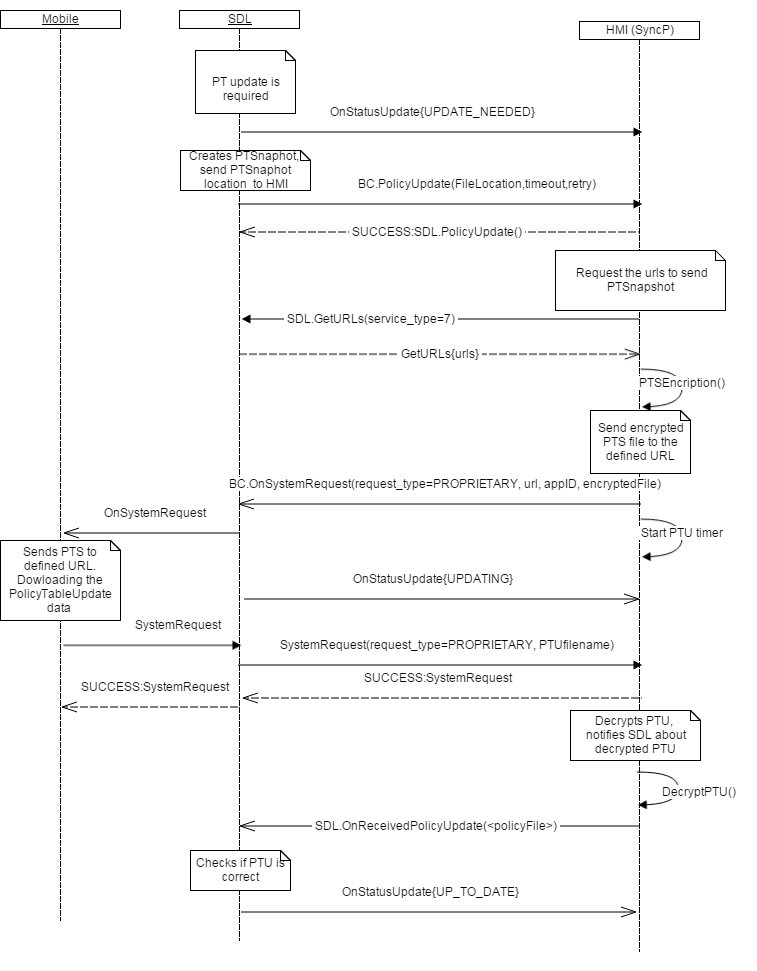
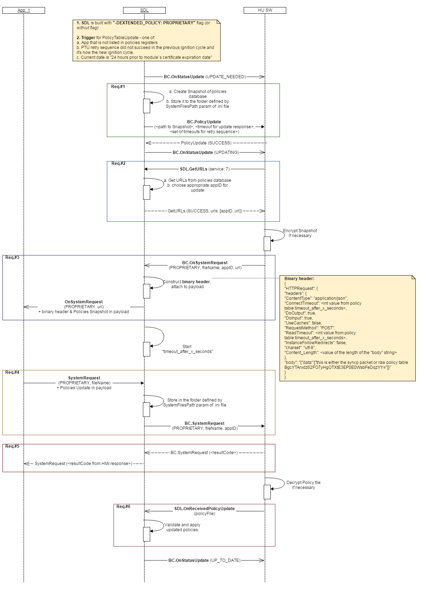
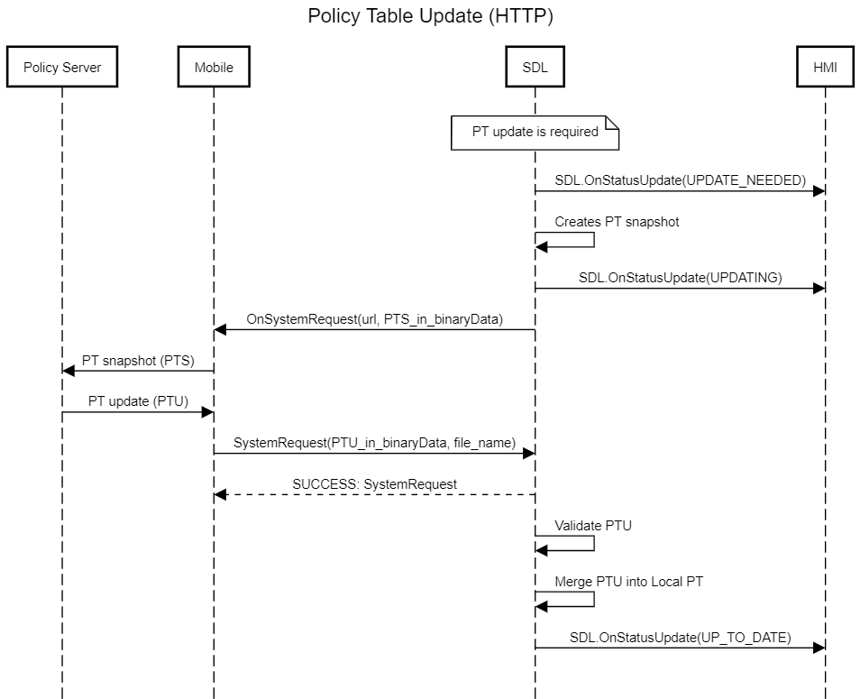

## PolicyUpdate

Type
: Function

Sender
: SDL

Purpose
: Inform HMI about the Policy Table Update (PTU) mechanism is triggered on SDL

In case SDL is built with **"-DEXTENDED_POLICY: HTTP" flag**, SDL supports PolicyTableUpdate flow **without HMI-related logic**. 
### Request
``BC.PolicyUpdate`` represents SDL-generated request to start the PTU sequence.

!!! MUST
**Proprietary Policies**:

* Encrypt the Snapshot PT (path from ``file`` parameter) _in case_ and by the scheme required by Policies Server
* Request Policies Server url via ``SDL.GetPolicyConfigurationData`` from SDL
* Parse the `url` received from json based on `serviceID`
* Provide the path defined by ``file`` parameter in the next ``BC.OnSystemRequest`` that SDL will forward to mobile application
* Recognize the PTU status notifications of ``SDL.OnStatusUpdate`` from SDL and display them in the appropriate UI menu
!!!

!!! NOTE
1. ``BC.PolicyUpdate`` dependencies:
   * SDL sends ``BC.PolicyUpdate`` _only in case_ it's built with "-DEXTENDED_POLICY: PROPRIETARY" flag or without this flag. _Otherwise_ SDL handles the entire PTU flow by itself.
   * If HMI fails to respond ``BC.PolicyUpdate`` or responds with error, PTU sequence will _not_ be continued.  
2. Triggers for sending ``BC.PolicyUpdate`` (whichever comes first):
   * Days since previous successful PTU (``"exchange_after_x_days"`` value in local PolicyTable (PT)
   * Kilometers since previous successful PTU (``"exchange_after_x_kilometers"`` value in local PT)
   * Ignition cycles since previous successful PTU (``"exchange_after_x_ignition_cycles"`` value in local PT)
   * 24 hours prior to module's certificate expiration date:
a. The triggers for checking the cert expiration status are:
Ignition On
TLS handshake
   * New application (that is, not-yet existing in local PT) registration
   * In case the status of PTU is UPDATE_NEEDED due to failed retry stratery at previous ignition cycle
3. Parameters values origin:
   * ``file`` - is the path to the Snapshot of local PolicyTable (Snapshot PT final destination is Policies Server)
   * ``timeout`` - value taken from ``"timeout_after_x_seconds"`` field of local PT
   * ``retry`` - array of values from ``"seconds_between_retries"`` field of local PT. SDL handles the PTU retry sequence (re-requesting update if fails to receive during timeout) by itself.
4. Custom VehicleData changes are available for application to use right after successful PTU.
5. When SDL  is built with EXTERNAL_PROPRIETARY flow, SDL _PoliciesManager_ must change the status to “UPDATING” and notify HMI with OnStatusUpdate("UPDATING") right after SnapshotPT is sent out to to mobile app via OnSystemRequest() RPC.
!!!

#### Parameters

|Name|Type|Mandatory|Additional|Description|
|:---|:---|:--------|:---------|:----------|
|file|String|true|minlength: 1<br>maxlength: 255|Location of policy table snapshot. It’s defined in smartDeviceLink.ini as  “PathToSnapshot” parameter|
|timeout|Integer|true|minvalue: 0<br>maxvalue: 65535|Send attempt timeout in seconds, it’s a value from the Policy Table.|
|retry|Integer|true|array: true<br>minsize: 1<br>maxsize: 5<br>minvalue: 0<br>maxvalue: 65535|Array of delays to wait after failed atempts, it’s a value from the Policy Table|

### Response

!!! MUST   
Respond with ``SUCCESS`` resultCode to continue the PTU flow.
!!!

#### Parameters

This RPC has no additional parameter requirements

### Sequence Diagrams

|||
BC.PolicyUpdate in EXTERNAL PROPRIETARY Policy Table Update Flow

|||

|||
BC.PolicyUpdate in PROPRIETARY Policy Table Update Flow

|||

|||
BC.PolicyUpdate in "HTTP" Policy Table Update Flow

|||

### Example Request

```json
{
	"id": 103,
	"jsonrpc": "2.0",
	"method": "BasicCommunication.PolicyUpdate",
	"params":
	{
		"file": " / tmp / fs / mp / SnapshotPT.json ",
		"timeout": 60,
		"retry": [1, 5, 25, 125, 625]
	}
}

```

### Example Response

```json
{
	"id": 103,
	"jsonrpc": "2.0",
	"result":
	{
		"code": 0,
		"method": "BasicCommunication.PolicyUpdate"
	}
}

```

### Example Error

```json
{
	"id": 103,
	"jsonrpc": "2.0",
	"error": {
		"code": 11,
		"message": "Snapshot PT file not found",
		"data":
		{
			"method": "BasicCommunication.PolicyUpdate"
		}
	}
}

```
