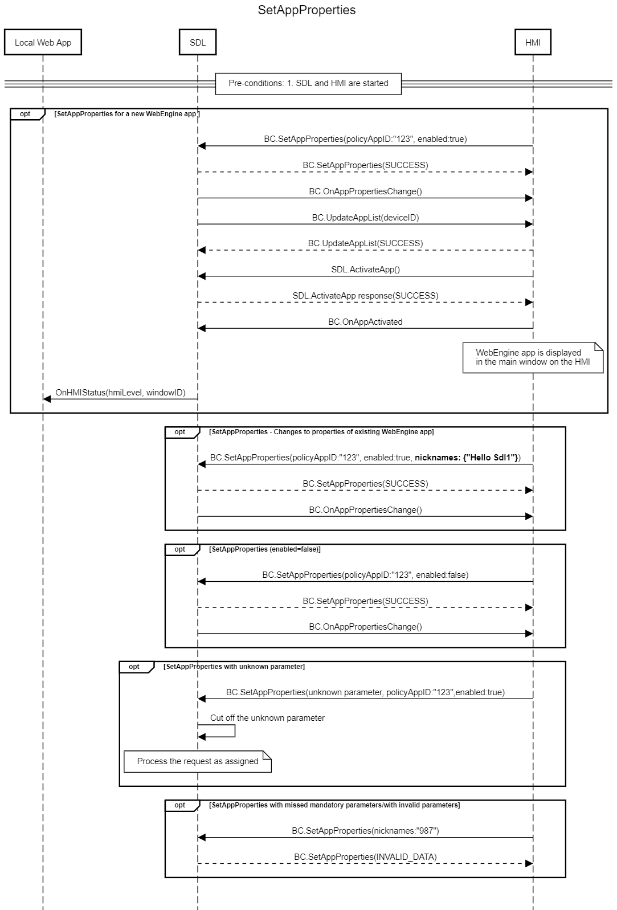

## SetAppProperties

Type
: Function

Sender
: HMI

Purpose
: Enable/disable an application and set authentication data

!!! must

1. Send `SetAppProperties`(enabled=true) if webEngine app is installed.

!!!

!!! may
* Request `UpdateSDL` after setting app properties to enforce SDL to perform PTU.
* Send `SetAppProperties`(enabled=false) to add not-installed webEngine apps to SDL

!!!

!!! info

* The OEM store uses app data in SDL Server (synchronized from SHAID) for SetAppProperties.
* If SDL does not know the `appID` it should trigger a PTU.

!!!

!!!

### Request

#### Parameters
|Name|Type|Mandatory|Additional|
|:---|:---|:--------|:---------|
|properties|[Common.AppProperties](../../common/structs/#appproperties)|true||


### Response

#### Parameters

This RPC has no additional parameter requirements.

### Example Request
```json
{
  "id" : 47,
  "jsonrpc" : "2.0",
  "method" : "BasicCommunication.SetAppProperties",
  "params" :
  {
    "properties": {
          "nicknames":
          {
              "Hello Sdl"
      },
      "policyAppID" : 123456, 
      "enabled": true, 
      "authToken":"AuthToken1234", 
      "transportType":"WS", 
      "hybridAppPreference": "CLOUD", 
      "endpoint": "index.html"
      },
    "code" : 0,
    "method" : "BasicCommunication.GetAppProperties"
    }
}
```

### Example Response

```json
{
  "id" : 47,
  "jsonrpc" : "2.0",
  "result" : 
  {
    "code" : 0,
    "method" : "BasicCommunication.SetAppProperties",
    }
}
```

### Example Error

```json
{
  "id" : 47,
  "jsonrpc" : "2.0",
  "error" :
  {
    "code" : 11,
    "message" : "Invalid data",
    "data" :
    {
      "method" : "BasicCommunication.SetAppProperties"
    }
  }
}
```

### Sequence Diagrams
|||
SetAppProperties

|||